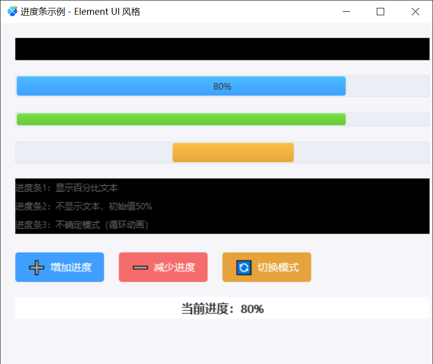
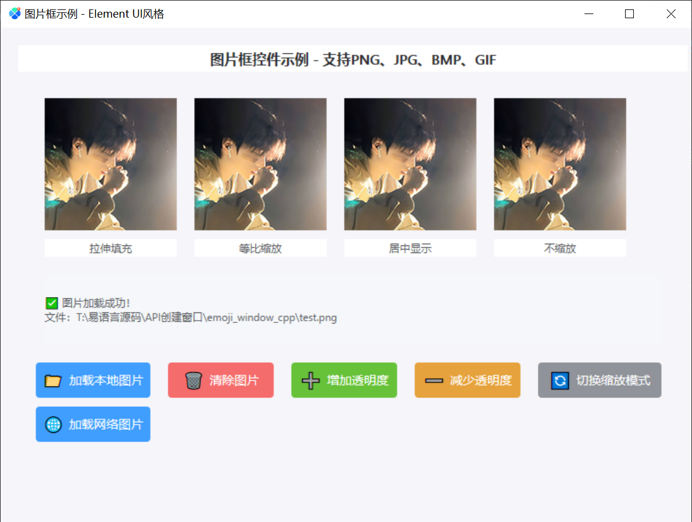
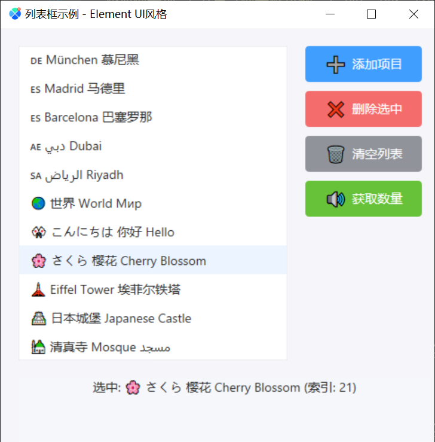
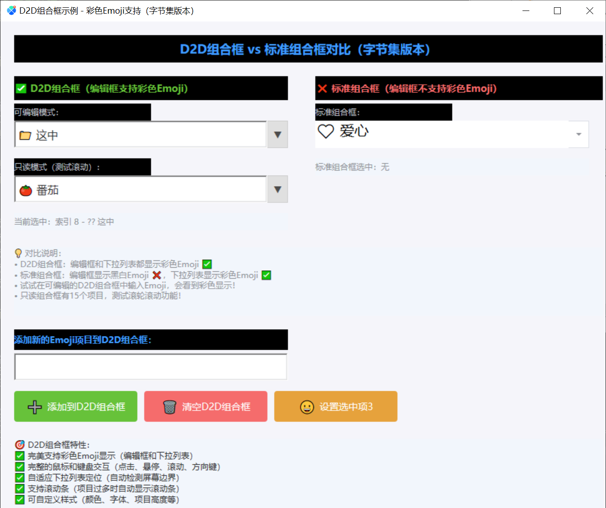
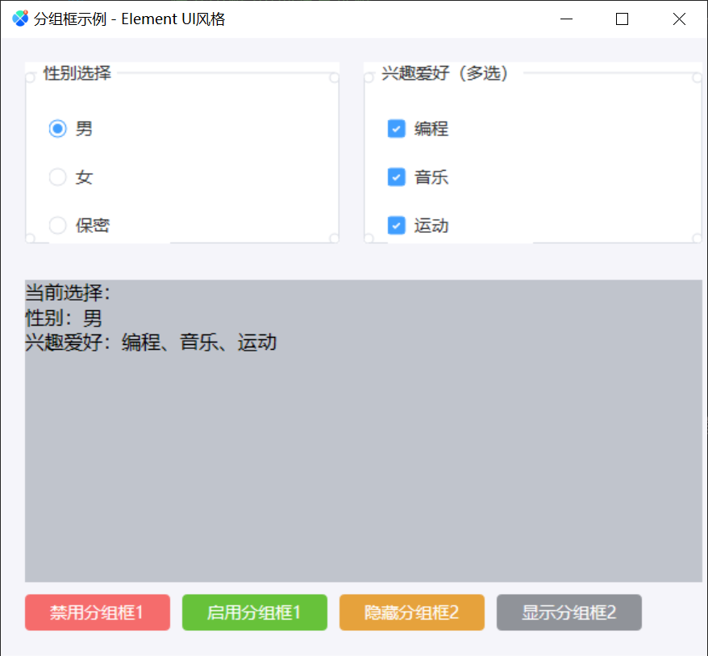
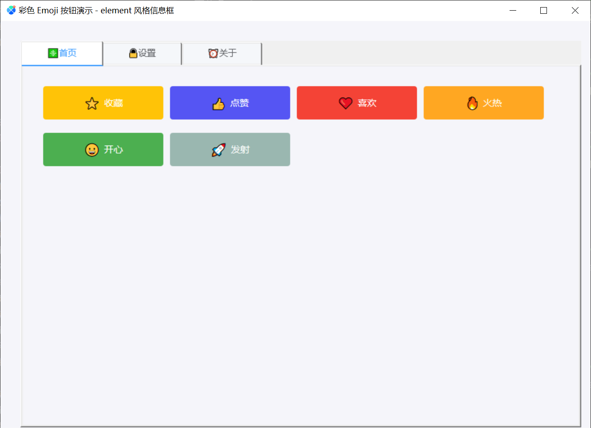
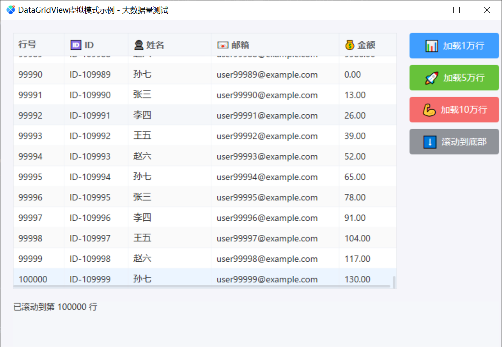
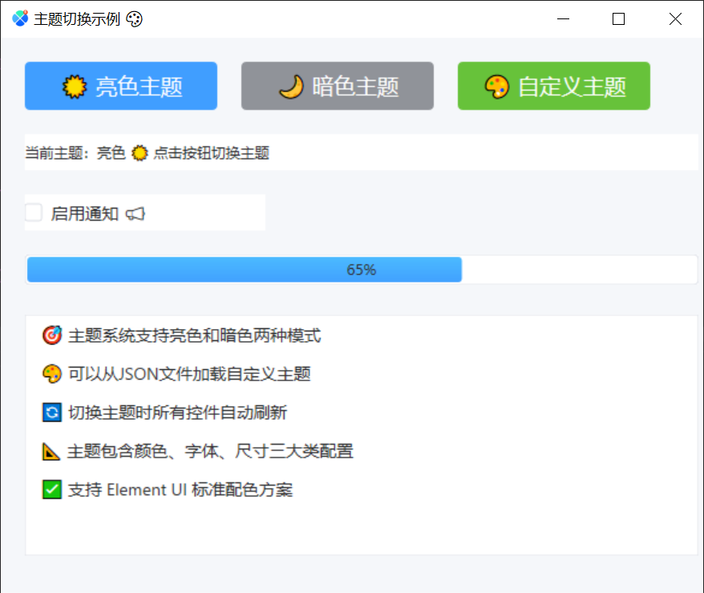
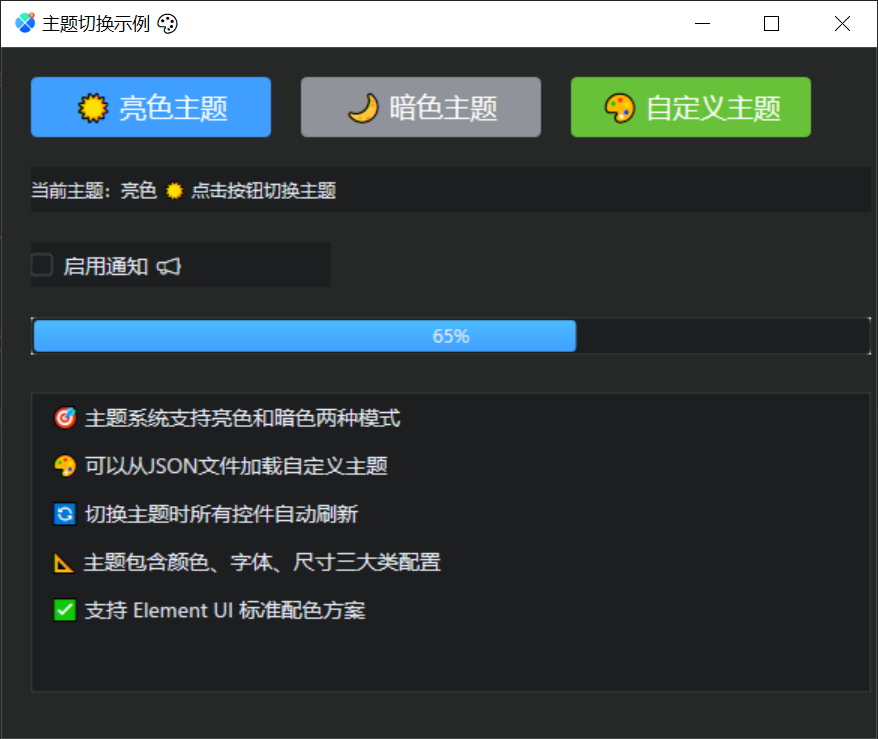

# Emoji Window DLL - C++ 版本

使用 C++ 和 Direct2D/DirectWrite 实现的 Windows UI 控件库，完美支持彩色 Emoji 显示。提供 16 种控件、布局管理器、主题系统和扩展事件系统，专为易语言应用设计。

## 界面截图预览

下面按功能分组展示部分现有示例截图，便于在阅读详细 API 之前快速了解控件风格与主题效果。

### 基础控件

#### 复选框


#### 进度条



#### 图片框



#### 列表框



#### 组合框



### 容器与布局

#### 分组框



#### 标签页控件



#### 网格布局


### 表格与高级展示

#### 表格基础示例


#### 表格自定义绘制


#### 表格虚拟模式



### 主题切换

#### 亮色主题



#### 暗色主题



## 项目结构

```
emoji_window_cpp/
├── emoji_window.sln              # Visual Studio 解决方案
├── emoji_window/
│   ├── emoji_window.vcxproj      # 项目文件
│   ├── dllmain.cpp               # DLL 入口（初始化 COM、D2D、DWrite）
│   ├── emoji_window.h            # 头文件（所有控件状态结构和 API 声明）
│   ├── emoji_window.cpp          # 主实现（所有控件逻辑和渲染）
│   └── emoji_window.def          # DLL 导出定义（210+ 导出函数）
├── themes/
│   ├── light.json                # 亮色主题（Element UI 标准配色）
│   └── dark.json                 # 暗色主题
├── 易语言代码/
│   ├── DLL命令.e                 # DLL API 声明
│   ├── 常量表.e                  # 颜色、布局、键码等常量
│   ├── 辅助程序集.e              # UTF-8 转换辅助函数
│   ├── 编码转换.e                # 编码转换工具
│   └── 窗口程序集_*.e            # 各控件示例程序（20+个）
└── x64/Release/
    └── emoji_window.dll          # 编译输出
```

## 编译步骤

### 1. 使用 Visual Studio（推荐）

1. 安装 Visual Studio 2019 或更高版本
2. 打开 `emoji_window.sln`
3. 选择 Release | x64 配置
4. 生成解决方案（Ctrl+Shift+B）
5. DLL 输出到 `x64\Release\emoji_window.dll`

### 2. 使用命令行（MSBuild）

```cmd
"C:\Program Files\Microsoft Visual Studio\2022\Community\MSBuild\Current\Bin\MSBuild.exe" emoji_window.sln /p:Configuration=Release /p:Platform=x64
```

## API 文档

### 创建窗口

```c++
HWND create_window(const char* title, int width, int height);
```

### 创建 Emoji 按钮（字节集）

```c++
int create_emoji_button_bytes(
    HWND parent,
    const unsigned char* emoji_bytes,
    int emoji_len,
    const unsigned char* text_bytes,
    int text_len,
    int x, int y, int width, int height,
    unsigned int bg_color
);
```

### 设置按钮点击回调

```c++
typedef void (__stdcall *ButtonClickCallback)(int button_id);
void __stdcall set_button_click_callback(ButtonClickCallback callback);
```

### 设置窗口大小改变回调

当自绘窗口大小被用户或代码改变时触发。

```c++
typedef void (__stdcall *WindowResizeCallback)(HWND hwnd, int width, int height);
void __stdcall SetWindowResizeCallback(WindowResizeCallback callback);
```

| 参数 | 说明 |
|------|------|
| `hwnd` | 发生大小改变的窗口句柄 |
| `width` | 窗口新的客户区宽度（像素） |
| `height` | 窗口新的客户区高度（像素） |

**易语言声明：**
```
.DLL命令 设置窗口大小改变回调, , "emoji_window.dll", "SetWindowResizeCallback"
    .参数 回调函数指针, 子程序指针
```

**易语言使用示例：**
```
.子程序 窗口大小改变回调, , 公开
.参数 窗口句柄_, 整数型
.参数 新宽度, 整数型
.参数 新高度, 整数型

' 窗口大小改变时更新布局
调试输出 ("窗口大小改变: " + 到文本 (新宽度) + " x " + 到文本 (新高度))

' 注册（程序初始化时调用一次）
设置窗口大小改变回调 (&窗口大小改变回调)
```

> **注意**：回调必须在创建窗口后、运行消息循环前完成注册。

---

### 设置窗口被关闭回调

当自绘窗口被关闭时触发（用户点击关闭按钮 ×，或代码调用 `destroy_window`，均会触发 `WM_DESTROY`）。

```c++
typedef void (__stdcall *WindowCloseCallback)(HWND hwnd);
void __stdcall SetWindowCloseCallback(WindowCloseCallback callback);
```

| 参数 | 说明 |
|------|------|
| `hwnd` | 被关闭的窗口句柄（触发时 HWND 已失效，仅用于识别是哪个窗口） |

**易语言声明：**
```
.DLL命令 设置窗口关闭回调, , "emoji_window.dll", "SetWindowCloseCallback"
    .参数 回调函数指针, 子程序指针
```

**易语言使用示例：**
```
.子程序 自绘窗口关闭回调, , 公开
.参数 已关闭的窗口句柄, 整数型

' 重置句柄变量，防止后续误用失效的 HWND
调试输出 ("自绘窗口已关闭, HWND=" + 到文本 (已关闭的窗口句柄))
.如果真 (窗口句柄 = 已关闭的窗口句柄)
    窗口句柄 = 0
.如果真结束
TabControl句柄 = 0

' 注册（程序初始化时调用一次）
设置窗口关闭回调 (&自绘窗口关闭回调)
```

> **注意**：
> - 回调触发时窗口已销毁，不要在回调内对该 `hwnd` 执行任何窗口操作。
> - 只有顶层窗口（非子窗口）关闭时才会触发此回调。
> - 若程序同时运行了 `run_message_loop`，关闭窗口后消息循环会自动退出；若由易语言消息循环驱动，则不会影响易语言进程。

---

### 设置窗口图标

设置窗口的图标（标题栏和任务栏显示）。

```c++
void __stdcall set_window_icon(HWND hwnd, const char* icon_path);
```

| 参数 | 说明 |
|------|------|
| `hwnd` | 窗口句柄 |
| `icon_path` | 图标文件路径（支持 .ico 格式） |

**易语言声明：**
```
.DLL命令 设置窗口图标, , "emoji_window.dll", "set_window_icon"
    .参数 窗口句柄, 整数型
    .参数 图标路径, 文本型
```

**易语言使用示例：**
```
设置窗口图标 (窗口句柄, "icon.ico")
```

---

### 设置窗口标题

设置窗口的标题文本（支持 UTF-8 编码）。

```c++
void __stdcall set_window_title(HWND hwnd, const unsigned char* title_bytes, int title_len);
```

| 参数 | 说明 |
|------|------|
| `hwnd` | 窗口句柄 |
| `title_bytes` | UTF-8 编码的标题字节集指针 |
| `title_len` | 字节集长度 |

**易语言声明：**
```
.DLL命令 设置窗口标题, , "emoji_window.dll", "set_window_title"
    .参数 窗口句柄, 整数型
    .参数 标题字节集指针, 整数型, , UTF-8字节集指针
    .参数 标题长度, 整数型, , 字节集长度
```

**易语言使用示例：**
```
.局部变量 标题文本, 文本型
.局部变量 标题UTF8, 字节集
.局部变量 标题指针, 整数型
.局部变量 标题长度, 整数型

标题文本 = "新窗口标题 🎉"
标题UTF8 = 到UTF8 (标题文本)
标题指针 = 取字节集数据地址 (标题UTF8)
标题长度 = 取字节集长度 (标题UTF8)

设置窗口标题 (窗口句柄, 标题指针, 标题长度)
```

#### 创建 Emoji 窗口（字节集扩展版）

当需要在创建窗口时同时指定 UTF-8 标题和标题栏颜色时，可使用扩展版创建命令。

**易语言声明：**
```
.DLL命令 创建Emoji窗口_字节集_扩展, 整数型, "emoji_window.dll", "create_window_bytes_ex", , 创建窗口（UTF-8字节集扩展版本，支持Emoji标题和标题栏颜色）, , 公开
    .参数 标题字节集指针, 整数型, , UTF-8标题字节集指针
    .参数 标题字节集长度, 整数型, , UTF-8标题字节集长度
    .参数 宽度, 整数型, , 窗口宽度
    .参数 高度, 整数型, , 窗口高度
    .参数 标题栏颜色, 整数型, , 标题栏颜色（十进制RGB颜色，0=跟随主题）
```

#### 设置窗口标题栏颜色

用于在窗口创建后单独修改标题栏颜色；传 `0` 表示恢复为跟随主题。

**易语言声明：**
```
.DLL命令 设置窗口标题栏颜色, , "emoji_window.dll", "set_window_titlebar_color", , , 设置窗口标题栏颜色（十进制RGB颜色，0=跟随主题）
    .参数 窗口句柄, 整数型
    .参数 标题栏颜色, 整数型
```

---

### 编辑框

#### 创建编辑框（含文本垂直居中）

单行编辑框支持**文本垂直居中**：创建时最后一个参数传 `TRUE` 即可；仅对单行有效，多行编辑框忽略该选项。

```c++
HWND __stdcall CreateEditBox(
    HWND hParent,
    int x, int y, int width, int height,
    const unsigned char* text_bytes, int text_len,
    UINT32 fg_color, UINT32 bg_color,
    const unsigned char* font_name_bytes, int font_name_len,
    int font_size, BOOL bold, BOOL italic, BOOL underline,
    int alignment,    // 0=左 1=中 2=右
    BOOL multiline, BOOL readonly, BOOL password, BOOL has_border,
    BOOL vertical_center   // 文本垂直居中（仅单行有效）
);
```

**说明**：系统单行 EDIT 不支持垂直居中，DLL 在“单行 + 垂直居中”时内部使用多行样式（`EM_SETRECTNP`）实现垂直居中，并拦截回车以保持单行行为；左右边距设为 0 以减少白边。

**易语言声明：** 在 `创建编辑框` 的 DLL 命令中，最后一个参数为 `文本垂直居中`（逻辑型）。

**易语言示例：**
```
编辑框1 ＝ 创建编辑框 (父句柄, 140, 30, 280, 60, 文本指针, 文本长, 前景色, 背景色, 字体名指针, 字体名长, 12, 假, 假, 假, 1, 假, 假, 假, 真, 真)
' 最后一参 真 = 启用文本垂直居中
```

#### 设置编辑框垂直居中（创建后修改）

创建后也可随时开关垂直居中：

```c++
void __stdcall SetEditBoxVerticalCenter(HWND hEdit, BOOL vertical_center);
```

**易语言声明：**
```
.DLL命令 设置编辑框垂直居中, , "emoji_window.dll", "SetEditBoxVerticalCenter", , , 设置编辑框文本是否垂直居中（仅单行有效）
    .参数 编辑框句柄, 整数型
    .参数 垂直居中, 逻辑型
```

#### 设置编辑框按键回调

可接收编辑框的按键按下/松开通知（不拦截按键）：

```c++
typedef void (__stdcall *EditBoxKeyCallback)(HWND hEdit, int key_code, int key_down, int shift, int ctrl, int alt);
void __stdcall SetEditBoxKeyCallback(HWND hEdit, EditBoxKeyCallback callback);
```

| 参数 | 说明 |
|------|------|
| `key_code` | Windows 虚拟键码（如 13=回车 27=Esc） |
| `key_down` | 1=按下 0=松开 |
| `shift` / `ctrl` / `alt` | 1=按下 0=未按 |

**易语言声明：**
```
.DLL命令 设置编辑框按键回调, , "emoji_window.dll", "SetEditBoxKeyCallback", , , 设置编辑框按键回调（key_down: 1=按下 0=松开）
    .参数 编辑框句柄, 整数型
    .参数 回调子程序指针, 整数型, , 子程序需 stdcall，参数：hEdit, key_code, key_down, shift, ctrl, alt（均为整数型）
```

**易语言**：子程序需 stdcall，参数为（编辑框句柄, 键码, 按下或松开, Shift, Ctrl, Alt）整数型；注册时传 `设置编辑框按键回调(编辑框句柄, 到整数(&子程序))`。

#### D2D 彩色 Emoji 编辑框

D2D 自绘版本提供与普通编辑框相似的接口，但命令名与导出名不同。

**易语言声明：**
```
.DLL命令 创建D2D彩色Emoji编辑框, 整数型, "emoji_window.dll", "CreateD2DColorEmojiEditBox", , , 创建支持彩色Emoji的D2D自定义编辑框（完美支持彩色emoji）
    .参数 父窗口句柄, 整数型
    .参数 X坐标, 整数型
    .参数 Y坐标, 整数型
    .参数 宽度, 整数型
    .参数 高度, 整数型
    .参数 文本字节集指针, 整数型, , UTF-8字节集指针
    .参数 文本长度, 整数型, , 字节集长度
    .参数 前景色, 整数型, , ARGB颜色
    .参数 背景色, 整数型, , ARGB颜色
    .参数 字体名字节集指针, 整数型, , UTF-8字节集指针
    .参数 字体名长度, 整数型, , 字节集长度
    .参数 字体大小, 整数型
    .参数 粗体, 逻辑型
    .参数 斜体, 逻辑型
    .参数 下划线, 逻辑型
    .参数 对齐方式, 整数型, , 0=左 1=中 2=右
    .参数 多行模式, 逻辑型
    .参数 只读模式, 逻辑型
    .参数 密码框, 逻辑型
    .参数 显示边框, 逻辑型
    .参数 文本垂直居中, 逻辑型, , 仅单行有效

.DLL命令 获取D2D编辑框文本, 整数型, "emoji_window.dll", "GetD2DEditBoxText", , , 获取D2D编辑框文本（返回UTF-8字节数）
    .参数 编辑框句柄, 整数型
    .参数 缓冲区指针, 整数型, , UTF-8字节集指针（可为0获取所需大小）
    .参数 缓冲区大小, 整数型, , 字节集大小

.DLL命令 设置D2D编辑框文本, , "emoji_window.dll", "SetD2DEditBoxText", , , 设置D2D编辑框文本
    .参数 编辑框句柄, 整数型
    .参数 文本字节集指针, 整数型, , UTF-8字节集指针
    .参数 文本长度, 整数型, , 字节集长度

.DLL命令 设置D2D编辑框按键回调, , "emoji_window.dll", "SetD2DEditBoxKeyCallback", , , 设置D2D编辑框按键回调
    .参数 编辑框句柄, 整数型
    .参数 回调子程序指针, 整数型, , 子程序需 stdcall，参数：hEdit, key_code, key_down, shift, ctrl, alt（均为整数型）

.DLL命令 启用D2D编辑框, , "emoji_window.dll", "EnableD2DEditBox", , , 启用/禁用D2D编辑框
    .参数 编辑框句柄, 整数型
    .参数 启用, 逻辑型

.DLL命令 显示D2D编辑框, , "emoji_window.dll", "ShowD2DEditBox", , , 显示/隐藏D2D编辑框
    .参数 编辑框句柄, 整数型
    .参数 显示, 逻辑型

.DLL命令 设置D2D编辑框位置, , "emoji_window.dll", "SetD2DEditBoxBounds", , , 设置D2D编辑框位置和大小
    .参数 编辑框句柄, 整数型
    .参数 X坐标, 整数型
    .参数 Y坐标, 整数型
    .参数 宽度, 整数型
    .参数 高度, 整数型

.DLL命令 设置D2D编辑框字体, , "emoji_window.dll", "SetD2DEditBoxFont", , , 设置D2D编辑框字体
    .参数 编辑框句柄, 整数型
    .参数 字体名字节集指针, 整数型, , UTF-8字节集指针
    .参数 字体名长度, 整数型, , 字节集长度
    .参数 字体大小, 整数型
    .参数 粗体, 逻辑型
    .参数 斜体, 逻辑型
    .参数 下划线, 逻辑型

.DLL命令 设置D2D编辑框颜色, , "emoji_window.dll", "SetD2DEditBoxColor", , , 设置D2D编辑框颜色
    .参数 编辑框句柄, 整数型
    .参数 前景色, 整数型, , ARGB颜色
    .参数 背景色, 整数型, , ARGB颜色
```

---

### 复选框（CheckBox）

#### 创建复选框

创建一个 Element UI 风格的复选框控件，支持选中/未选中状态切换。

```c++
HWND __stdcall CreateCheckBox(
    HWND hParent,
    int x, int y, int width, int height,
    const unsigned char* text_bytes, int text_len,
    BOOL checked,
    UINT32 fg_color,
    UINT32 bg_color
);
```

| 参数 | 说明 |
|------|------|
| `hParent` | 父窗口句柄 |
| `x, y` | 控件位置 |
| `width, height` | 控件尺寸 |
| `text_bytes` | UTF-8 编码的文本字节集指针 |
| `text_len` | 文本字节集长度 |
| `checked` | 初始选中状态（TRUE=选中，FALSE=未选中） |
| `fg_color` | 前景色（ARGB格式，如 0xFF303133） |
| `bg_color` | 背景色（ARGB格式，如 0xFFFFFFFF） |

**返回值**：复选框控件句柄

**易语言声明：**
```
.DLL命令 创建复选框, 整数型, "emoji_window.dll", "CreateCheckBox"
    .参数 父窗口句柄, 整数型
    .参数 X坐标, 整数型
    .参数 Y坐标, 整数型
    .参数 宽度, 整数型
    .参数 高度, 整数型
    .参数 文本字节集指针, 整数型
    .参数 文本长度, 整数型
    .参数 选中状态, 逻辑型
    .参数 前景色, 整数型, , ARGB颜色
    .参数 背景色, 整数型, , ARGB颜色
```

**易语言使用示例：**
```
.局部变量 复选框句柄, 整数型
.局部变量 文本UTF8, 字节集
.局部变量 文本指针, 整数型

文本UTF8 = 到UTF8 ("接受用户协议")
文本指针 = 取字节集数据地址 (文本UTF8)

复选框句柄 = 创建复选框 (窗口句柄, 50, 80, 200, 30, 文本指针, 取字节集长度 (文本UTF8), 假, #FF303133, #FFFFFFFF)
```

#### 获取复选框状态

获取复选框当前的选中状态。

```c++
BOOL __stdcall GetCheckBoxState(HWND hCheckBox);
```

**返回值**：TRUE=选中，FALSE=未选中

**易语言声明：**
```
.DLL命令 获取复选框状态, 逻辑型, "emoji_window.dll", "GetCheckBoxState"
    .参数 复选框句柄, 整数型
```

#### 设置复选框状态

设置复选框的选中状态。

```c++
void __stdcall SetCheckBoxState(HWND hCheckBox, BOOL checked);
```

**易语言声明：**
```
.DLL命令 设置复选框状态, , "emoji_window.dll", "SetCheckBoxState"
    .参数 复选框句柄, 整数型
    .参数 选中状态, 逻辑型
```

#### 设置复选框回调

设置复选框状态改变时的回调函数。

```c++
typedef void (__stdcall *CheckBoxCallback)(HWND hCheckBox, BOOL checked);
void __stdcall SetCheckBoxCallback(HWND hCheckBox, CheckBoxCallback callback);
```

| 回调参数 | 说明 |
|---------|------|
| `hCheckBox` | 复选框句柄 |
| `checked` | 新的选中状态（TRUE=选中，FALSE=未选中） |

**易语言声明：**
```
.DLL命令 设置复选框回调, , "emoji_window.dll", "SetCheckBoxCallback"
    .参数 复选框句柄, 整数型
    .参数 回调子程序指针, 整数型
```

**易语言回调示例：**
```
.子程序 复选框回调, , 公开, stdcall
.参数 复选框句柄, 整数型
.参数 选中状态, 逻辑型

调试输出 ("复选框状态改变：", 选中状态)

' 注册回调
设置复选框回调 (复选框句柄, &复选框回调)
```

#### 启用/禁用复选框

控制复选框是否可以交互。

```c++
void __stdcall EnableCheckBox(HWND hCheckBox, BOOL enable);
```

**易语言声明：**
```
.DLL命令 启用复选框, , "emoji_window.dll", "EnableCheckBox"
    .参数 复选框句柄, 整数型
    .参数 启用, 逻辑型
```

#### 显示/隐藏复选框

控制复选框的可见性。

```c++
void __stdcall ShowCheckBox(HWND hCheckBox, BOOL show);
```

**易语言声明：**
```
.DLL命令 显示复选框, , "emoji_window.dll", "ShowCheckBox"
    .参数 复选框句柄, 整数型
    .参数 显示, 逻辑型
```

#### 设置复选框文本

动态修改复选框的显示文本。

```c++
void __stdcall SetCheckBoxText(HWND hCheckBox, const unsigned char* text_bytes, int text_len);
```

**易语言声明：**
```
.DLL命令 设置复选框文本, , "emoji_window.dll", "SetCheckBoxText"
    .参数 复选框句柄, 整数型
    .参数 文本字节集指针, 整数型
    .参数 文本长度, 整数型
```

#### 设置复选框位置和大小

动态调整复选框的位置和尺寸。

```c++
void __stdcall SetCheckBoxBounds(HWND hCheckBox, int x, int y, int width, int height);
```

**易语言声明：**
```
.DLL命令 设置复选框位置, , "emoji_window.dll", "SetCheckBoxBounds"
    .参数 复选框句柄, 整数型
    .参数 X坐标, 整数型
    .参数 Y坐标, 整数型
    .参数 宽度, 整数型
    .参数 高度, 整数型
```

#### 复选框样式说明

复选框采用 Element UI 设计规范：
- 复选框尺寸：14x14 像素
- 圆角半径：2px
- 选中颜色：#409EFF（Element UI 主色）
- 边框颜色：#DCDFE6（默认）/ #409EFF（悬停/选中）
- 禁用颜色：#C0C4CC
- 文本字体：Microsoft YaHei UI，14px
- 文本间距：复选框右侧 8px

**完整易语言示例：**
```
.版本 2

.程序集变量 窗口句柄, 整数型
.程序集变量 复选框1, 整数型

.子程序 _启动窗口_创建完毕

窗口句柄 = 创建Emoji窗口 ("复选框示例", 400, 300)

' 创建复选框
.局部变量 文本UTF8, 字节集
.局部变量 文本指针, 整数型

文本UTF8 = 到UTF8 ("接受用户协议")
文本指针 = 取字节集数据地址 (文本UTF8)

复选框1 = 创建复选框 (窗口句柄, 50, 80, 200, 30, 文本指针, 取字节集长度 (文本UTF8), 假, #FF303133, #FFFFFFFF)

' 设置回调
设置复选框回调 (复选框1, &复选框回调)


.子程序 复选框回调, , 公开, stdcall
.参数 复选框句柄, 整数型
.参数 选中状态, 逻辑型

调试输出 ("复选框状态：", 选中状态)
```

---

### 进度条（ProgressBar）

#### 创建进度条

创建一个 Element UI 风格的进度条控件，支持确定模式和不确定模式。

```c++
HWND __stdcall CreateProgressBar(
    HWND hParent,
    int x, int y, int width, int height,
    int initial_value,
    UINT32 fg_color,
    UINT32 bg_color,
    BOOL show_text,
    UINT32 text_color
);
```

| 参数 | 说明 |
|------|------|
| `hParent` | 父窗口句柄 |
| `x, y` | 控件位置 |
| `width, height` | 控件尺寸 |
| `initial_value` | 初始进度值（0-100） |
| `fg_color` | 前景色/进度条颜色（ARGB格式，如 0xFF409EFF） |
| `bg_color` | 背景色（ARGB格式，如 0xFFEBEEF5） |
| `show_text` | 是否显示百分比文本（TRUE=显示，FALSE=不显示） |
| `text_color` | 文本颜色（ARGB格式，如 0xFFFFFFFF 白色） |

**返回值**：进度条控件句柄

**易语言声明：**
```
.DLL命令 创建进度条, 整数型, "emoji_window.dll", "CreateProgressBar"
    .参数 父窗口句柄, 整数型
    .参数 X坐标, 整数型
    .参数 Y坐标, 整数型
    .参数 宽度, 整数型
    .参数 高度, 整数型
    .参数 初始值, 整数型, , 0-100
    .参数 前景色, 整数型, , ARGB颜色
    .参数 背景色, 整数型, , ARGB颜色
    .参数 显示文本, 逻辑型
    .参数 文本颜色, 整数型, , ARGB颜色
```

**易语言使用示例：**
```
.局部变量 进度条句柄, 整数型

' 创建显示百分比的进度条（白色文本）
进度条句柄 = 创建进度条 (窗口句柄, 50, 80, 400, 30, 0, #409EFF, #EBEEF5, 真, #FFFFFFFF)

' 创建不显示百分比的进度条
进度条句柄 = 创建进度条 (窗口句柄, 50, 120, 400, 20, 50, #67C23A, #EBEEF5, 假, #FFFFFFFF)
```

#### 设置进度条值

设置进度条的当前值（0-100），支持平滑动画过渡。

```c++
void __stdcall SetProgressValue(HWND hProgressBar, int value);
```

| 参数 | 说明 |
|------|------|
| `hProgressBar` | 进度条句柄 |
| `value` | 进度值（0-100，超出范围会自动限制） |

**易语言声明：**
```
.DLL命令 设置进度条值, , "emoji_window.dll", "SetProgressValue"
    .参数 进度条句柄, 整数型
    .参数 值, 整数型, , 0-100
```

**易语言使用示例：**
```
设置进度条值 (进度条句柄, 75)  ' 设置为75%
```

#### 获取进度条值

获取进度条当前的进度值。

```c++
int __stdcall GetProgressValue(HWND hProgressBar);
```

**返回值**：当前进度值（0-100）

**易语言声明：**
```
.DLL命令 获取进度条值, 整数型, "emoji_window.dll", "GetProgressValue"
    .参数 进度条句柄, 整数型
```

#### 设置进度条不确定模式

设置进度条为不确定模式（循环动画），用于无法确定具体进度的场景。

```c++
void __stdcall SetProgressIndeterminate(HWND hProgressBar, BOOL indeterminate);
```

| 参数 | 说明 |
|------|------|
| `hProgressBar` | 进度条句柄 |
| `indeterminate` | TRUE=不确定模式，FALSE=确定模式 |

**易语言声明：**
```
.DLL命令 设置进度条不确定模式, , "emoji_window.dll", "SetProgressIndeterminate"
    .参数 进度条句柄, 整数型
    .参数 不确定模式, 逻辑型
```

**易语言使用示例：**
```
' 启用不确定模式（显示循环动画）
设置进度条不确定模式 (进度条句柄, 真)

' 恢复确定模式
设置进度条不确定模式 (进度条句柄, 假)
```

#### 设置进度条颜色

动态修改进度条的前景色和背景色。

```c++
void __stdcall SetProgressBarColor(HWND hProgressBar, UINT32 fg_color, UINT32 bg_color);
```

**易语言声明：**
```
.DLL命令 设置进度条颜色, , "emoji_window.dll", "SetProgressBarColor"
    .参数 进度条句柄, 整数型
    .参数 前景色, 整数型, , ARGB颜色
    .参数 背景色, 整数型, , ARGB颜色
```

**易语言使用示例：**
```
' 设置为成功状态（绿色）
设置进度条颜色 (进度条句柄, #67C23A, #EBEEF5)

' 设置为警告状态（橙色）
设置进度条颜色 (进度条句柄, #E6A23C, #EBEEF5)

' 设置为错误状态（红色）
设置进度条颜色 (进度条句柄, #F56C6C, #EBEEF5)
```

#### 设置进度条回调

设置进度条值改变时的回调函数。

```c++
typedef void (__stdcall *ProgressBarCallback)(HWND hProgressBar, int value);
void __stdcall SetProgressBarCallback(HWND hProgressBar, ProgressBarCallback callback);
```

| 回调参数 | 说明 |
|---------|------|
| `hProgressBar` | 进度条句柄 |
| `value` | 新的进度值（0-100） |

**易语言声明：**
```
.DLL命令 设置进度条回调, , "emoji_window.dll", "SetProgressBarCallback"
    .参数 进度条句柄, 整数型
    .参数 回调子程序指针, 整数型
```

**易语言回调示例：**
```
.子程序 进度条回调, , 公开, stdcall
.参数 进度条句柄, 整数型
.参数 值, 整数型

调试输出 ("进度改变：", 值, "%")

' 注册回调
设置进度条回调 (进度条句柄, &进度条回调)
```

#### 启用/禁用进度条

控制进度条是否可以交互（禁用时显示灰色）。

```c++
void __stdcall EnableProgressBar(HWND hProgressBar, BOOL enable);
```

**易语言声明：**
```
.DLL命令 启用进度条, , "emoji_window.dll", "EnableProgressBar"
    .参数 进度条句柄, 整数型
    .参数 启用, 逻辑型
```

#### 显示/隐藏进度条

控制进度条的可见性。

```c++
void __stdcall ShowProgressBar(HWND hProgressBar, BOOL show);
```

**易语言声明：**
```
.DLL命令 显示进度条, , "emoji_window.dll", "ShowProgressBar"
    .参数 进度条句柄, 整数型
    .参数 显示, 逻辑型
```

#### 设置进度条位置和大小

动态调整进度条的位置和尺寸。

```c++
void __stdcall SetProgressBarBounds(HWND hProgressBar, int x, int y, int width, int height);
```

**易语言声明：**
```
.DLL命令 设置进度条位置, , "emoji_window.dll", "SetProgressBarBounds"
    .参数 进度条句柄, 整数型
    .参数 X坐标, 整数型
    .参数 Y坐标, 整数型
    .参数 宽度, 整数型
    .参数 高度, 整数型
```

#### 设置是否显示百分比文本

动态控制是否在进度条上显示百分比文本。

```c++
void __stdcall SetProgressBarShowText(HWND hProgressBar, BOOL show_text);
```

**易语言声明：**
```
.DLL命令 设置进度条显示文本, , "emoji_window.dll", "SetProgressBarShowText"
    .参数 进度条句柄, 整数型
    .参数 显示文本, 逻辑型
```

#### 进度条样式说明

进度条采用 Element UI 设计规范：
- 圆角半径：4px
- 边框颜色：#DCDFE6
- 默认前景色：#409EFF（Element UI 主色）
- 默认背景色：#EBEEF5
- 禁用前景色：#C0C4CC
- 禁用背景色：#F5F7FA
- 渐变效果：垂直线性渐变（顶部较亮）
- 动画帧率：60fps
- 平滑过渡：使用缓动函数
- 不确定模式：30% 宽度的进度条循环移动

**Element UI 状态颜色：**
- 主要/信息：#409EFF
- 成功：#67C23A
- 警告：#E6A23C
- 危险/错误：#F56C6C

**完整易语言示例：**
```
.版本 2

.程序集变量 窗口句柄, 整数型
.程序集变量 进度条1, 整数型
.程序集变量 进度条2, 整数型
.程序集变量 当前值, 整数型

.子程序 _启动窗口_创建完毕

窗口句柄 = 创建Emoji窗口 ("进度条示例", 600, 400)

' 创建普通进度条（显示百分比，白色文本）
进度条1 = 创建进度条 (窗口句柄, 50, 80, 500, 30, 0, #409EFF, #EBEEF5, 真, #FFFFFFFF)

' 创建不确定模式进度条
进度条2 = 创建进度条 (窗口句柄, 50, 130, 500, 30, 0, #E6A23C, #EBEEF5, 假, #FFFFFFFF)
设置进度条不确定模式 (进度条2, 真)

' 设置回调
设置进度条回调 (进度条1, &进度条回调)

当前值 = 0


.子程序 按钮_增加进度_被单击

当前值 = 当前值 + 10
.如果真 (当前值 > 100)
    当前值 = 100
.如果真结束

设置进度条值 (进度条1, 当前值)


.子程序 进度条回调, , 公开, stdcall
.参数 进度条句柄, 整数型
.参数 值, 整数型

调试输出 ("进度：", 值, "%")

.如果真 (值 = 100)
    ' 完成时改为绿色
    设置进度条颜色 (进度条句柄, #67C23A, #EBEEF5)
.如果真结束
```

---

### 运行消息循环

```c++
int run_message_loop();
```

## 易语言调用示例

参见 `examples/test.txt`

## 技术细节

- **渲染引擎**: Direct2D
- **文字渲染**: DirectWrite
- **彩色 Emoji**: `D2D1_DRAW_TEXT_OPTIONS_ENABLE_COLOR_FONT`
- **字体**: Segoe UI Emoji
- **编译器**: MSVC 2019+
- **平台**: Windows 10+

## 依赖项

- Windows SDK 10.0 或更高
- Direct2D
- DirectWrite
- 无需额外运行时（静态链接）

## 许可证

MIT License


---

### 图片框（PictureBox）

#### 创建图片框

创建一个图片框控件，支持多种图片格式和缩放模式。

```c++
HWND __stdcall CreatePictureBox(
    HWND hParent,
    int x, int y, int width, int height,
    int scale_mode,
    UINT32 bg_color
);
```

| 参数 | 说明 |
|------|------|
| `hParent` | 父窗口句柄 |
| `x, y` | 控件位置 |
| `width, height` | 控件尺寸 |
| `scale_mode` | 缩放模式（0=不缩放，1=拉伸填充，2=等比缩放适应，3=居中显示） |
| `bg_color` | 背景色（ARGB格式，如 0xFFF5F7FA） |

**返回值**：图片框控件句柄

**缩放模式说明：**
- `SCALE_NONE (0)`: 不缩放，左上角对齐显示原始尺寸
- `SCALE_STRETCH (1)`: 拉伸填充整个控件区域（可能变形）
- `SCALE_FIT (2)`: 等比缩放适应控件（保持宽高比，居中显示）
- `SCALE_CENTER (3)`: 居中显示原始尺寸（不缩放）

**易语言声明：**
```
.DLL命令 创建图片框, 整数型, "emoji_window.dll", "CreatePictureBox"
    .参数 父窗口句柄, 整数型
    .参数 X坐标, 整数型
    .参数 Y坐标, 整数型
    .参数 宽度, 整数型
    .参数 高度, 整数型
    .参数 缩放模式, 整数型, , 0=不缩放 1=拉伸 2=等比缩放 3=居中
    .参数 背景色, 整数型, , ARGB颜色
```

**易语言使用示例：**
```
.局部变量 图片框句柄, 整数型

' 创建等比缩放的图片框
图片框句柄 = 创建图片框 (窗口句柄, 50, 80, 300, 200, 2, #FFF5F7FA)
```

#### 从文件加载图片

从文件加载图片到图片框，支持 PNG、JPG、BMP、GIF 格式。

```c++
BOOL __stdcall LoadImageFromFile(
    HWND hPictureBox,
    const unsigned char* file_path_bytes,
    int path_len
);
```

| 参数 | 说明 |
|------|------|
| `hPictureBox` | 图片框句柄 |
| `file_path_bytes` | UTF-8 编码的文件路径字节集指针 |
| `path_len` | 路径字节集长度 |

**返回值**：TRUE=加载成功，FALSE=加载失败

**支持的图片格式：**
- PNG（支持透明通道）
- JPEG/JPG
- BMP
- GIF（仅显示第一帧）

**易语言声明：**
```
.DLL命令 从文件加载图片, 逻辑型, "emoji_window.dll", "LoadImageFromFile"
    .参数 图片框句柄, 整数型
    .参数 文件路径字节集指针, 整数型
    .参数 路径长度, 整数型
```

**易语言使用示例：**
```
.局部变量 路径UTF8, 字节集
.局部变量 路径指针, 整数型
.局部变量 成功, 逻辑型

路径UTF8 = 到UTF8 ("images\\photo.png")
路径指针 = 取字节集数据地址 (路径UTF8)

成功 = 从文件加载图片 (图片框句柄, 路径指针, 取字节集长度 (路径UTF8))

.如果真 (成功)
    调试输出 ("图片加载成功")
.否则
    调试输出 ("图片加载失败")
.如果真结束
```

#### 从内存加载图片

从内存字节数组加载图片到图片框。

```c++
BOOL __stdcall LoadImageFromMemory(
    HWND hPictureBox,
    const unsigned char* image_data,
    int data_len
);
```

| 参数 | 说明 |
|------|------|
| `hPictureBox` | 图片框句柄 |
| `image_data` | 图片数据字节集指针 |
| `data_len` | 数据字节集长度 |

**返回值**：TRUE=加载成功，FALSE=加载失败

**⚠️ 重要注意事项：**

在易语言中使用 `从内存加载图片` 时，**必须使用程序集变量（全局变量）保存图片数据**，不能使用局部变量！

**原因：** DLL 内部使用 WIC (Windows Imaging Component) 异步解码图片。如果使用局部变量，当子程序返回后，易语言会释放或移动局部变量的内存，导致 DLL 中保存的数据指针失效，图片显示为黑色。

**❌ 错误示例（使用局部变量）：**
```
.子程序 加载图片按钮_被单击
.局部变量 图片数据, 字节集  ' ❌ 错误！局部变量会被释放
.局部变量 数据指针, 整数型

图片数据 ＝ HTTP读文件 ("https://example.com/image.png")
数据指针 ＝ 取变量数据地址 (图片数据)
从内存加载图片 (图片框句柄, 数据指针, 取字节集长度 (图片数据))
' 子程序返回后，图片数据被释放，图片显示黑色！
```

**✅ 正确示例（使用程序集变量）：**
```
.程序集变量 全局_图片数据, 字节集  ' ✅ 正确！使用程序集变量

.子程序 加载图片按钮_被单击
.局部变量 数据指针, 整数型

全局_图片数据 ＝ HTTP读文件 ("https://example.com/image.png")
数据指针 ＝ 取变量数据地址 (全局_图片数据)
从内存加载图片 (图片框句柄, 数据指针, 取字节集长度 (全局_图片数据))
' 程序集变量不会被释放，图片正常显示！
```

**易语言声明：**
```
.DLL命令 从内存加载图片, 逻辑型, "emoji_window.dll", "LoadImageFromMemory"
    .参数 图片框句柄, 整数型
    .参数 图片数据指针, 整数型
    .参数 数据长度, 整数型
```

**易语言使用示例：**
```
.程序集变量 全局_图片数据, 字节集  ' 必须是程序集变量！

.子程序 从内存加载示例
.局部变量 数据指针, 整数型
.局部变量 成功, 逻辑型

' 方法1：从本地文件读入内存
全局_图片数据 ＝ 读入文件 ("photo.png")

' 方法2：从网络下载到内存
全局_图片数据 ＝ HTTP读文件 ("https://example.com/image.png")

' 加载图片
数据指针 ＝ 取变量数据地址 (全局_图片数据)
成功 ＝ 从内存加载图片 (图片框句柄, 数据指针, 取字节集长度 (全局_图片数据))

.如果真 (成功)
    调试输出 ("图片加载成功")
.否则
    调试输出 ("图片加载失败")
.如果真结束
```

#### 清除图片

清除图片框中的图片，释放图片资源。

```c++
void __stdcall ClearImage(HWND hPictureBox);
```

**易语言声明：**
```
.DLL命令 清除图片, , "emoji_window.dll", "ClearImage"
    .参数 图片框句柄, 整数型
```

**易语言使用示例：**
```
清除图片 (图片框句柄)
```

#### 设置图片透明度

设置图片的透明度（Alpha 通道混合）。

```c++
void __stdcall SetImageOpacity(HWND hPictureBox, float opacity);
```

| 参数 | 说明 |
|------|------|
| `hPictureBox` | 图片框句柄 |
| `opacity` | 透明度（0.0=完全透明，1.0=完全不透明） |

**易语言声明：**
```
.DLL命令 设置图片透明度, , "emoji_window.dll", "SetImageOpacity"
    .参数 图片框句柄, 整数型
    .参数 透明度, 小数型, , 0.0-1.0
```

**易语言使用示例：**
```
' 设置为50%透明度
设置图片透明度 (图片框句柄, 0.5)

' 设置为完全不透明
设置图片透明度 (图片框句柄, 1.0)

' 设置为完全透明
设置图片透明度 (图片框句柄, 0.0)
```

#### 设置图片框回调

设置图片框被点击时的回调函数。

```c++
typedef void (__stdcall *PictureBoxCallback)(HWND hPictureBox);
void __stdcall SetPictureBoxCallback(HWND hPictureBox, PictureBoxCallback callback);
```

| 回调参数 | 说明 |
|---------|------|
| `hPictureBox` | 图片框句柄 |

**易语言声明：**
```
.DLL命令 设置图片框回调, , "emoji_window.dll", "SetPictureBoxCallback"
    .参数 图片框句柄, 整数型
    .参数 回调子程序指针, 整数型
```

**易语言回调示例：**
```
.子程序 图片框回调, , 公开, stdcall
.参数 图片框句柄, 整数型

调试输出 ("图片框被点击")

' 注册回调
设置图片框回调 (图片框句柄, &图片框回调)
```

#### 启用/禁用图片框

控制图片框是否可以交互。

```c++
void __stdcall EnablePictureBox(HWND hPictureBox, BOOL enable);
```

**易语言声明：**
```
.DLL命令 启用图片框, , "emoji_window.dll", "EnablePictureBox"
    .参数 图片框句柄, 整数型
    .参数 启用, 逻辑型
```

#### 显示/隐藏图片框

控制图片框的可见性。

```c++
void __stdcall ShowPictureBox(HWND hPictureBox, BOOL show);
```

**易语言声明：**
```
.DLL命令 显示图片框, , "emoji_window.dll", "ShowPictureBox"
    .参数 图片框句柄, 整数型
    .参数 显示, 逻辑型
```

#### 设置图片框位置和大小

动态调整图片框的位置和尺寸。

```c++
void __stdcall SetPictureBoxBounds(HWND hPictureBox, int x, int y, int width, int height);
```

**易语言声明：**
```
.DLL命令 设置图片框位置, , "emoji_window.dll", "SetPictureBoxBounds"
    .参数 图片框句柄, 整数型
    .参数 X坐标, 整数型
    .参数 Y坐标, 整数型
    .参数 宽度, 整数型
    .参数 高度, 整数型
```

#### 设置图片框缩放模式

动态修改图片框的缩放模式。

```c++
void __stdcall SetPictureBoxScaleMode(HWND hPictureBox, int scale_mode);
```

**易语言声明：**
```
.DLL命令 设置图片框缩放模式, , "emoji_window.dll", "SetPictureBoxScaleMode"
    .参数 图片框句柄, 整数型
    .参数 缩放模式, 整数型, , 0=不缩放 1=拉伸 2=等比缩放 3=居中
```

**易语言使用示例：**
```
' 切换为拉伸模式
设置图片框缩放模式 (图片框句柄, 1)

' 切换为等比缩放模式
设置图片框缩放模式 (图片框句柄, 2)
```

#### 设置图片框背景色

动态修改图片框的背景色。

```c++
void __stdcall SetPictureBoxBackgroundColor(HWND hPictureBox, UINT32 bg_color);
```

**易语言声明：**
```
.DLL命令 设置图片框背景色, , "emoji_window.dll", "SetPictureBoxBackgroundColor"
    .参数 图片框句柄, 整数型
    .参数 背景色, 整数型, , ARGB颜色
```

#### 图片框技术说明

图片框使用以下技术实现：
- **图片加载**：WIC (Windows Imaging Component)
- **图片渲染**：Direct2D
- **支持格式**：PNG、JPEG、BMP、GIF（通过 WIC 解码器）
- **透明通道**：完全支持 Alpha 通道混合
- **硬件加速**：使用 GPU 加速渲染
- **插值模式**：线性插值（D2D1_BITMAP_INTERPOLATION_MODE_LINEAR）

**完整易语言示例：**
```
.版本 2

.程序集变量 窗口句柄, 整数型
.程序集变量 图片框1, 整数型
.程序集变量 图片框2, 整数型

.子程序 _启动窗口_创建完毕

窗口句柄 = 创建Emoji窗口 ("图片框示例", 800, 600)

' 创建拉伸模式图片框
图片框1 = 创建图片框 (窗口句柄, 50, 80, 300, 200, 1, #FFF5F7FA)

' 创建等比缩放模式图片框
图片框2 = 创建图片框 (窗口句柄, 400, 80, 300, 200, 2, #FFF5F7FA)

' 加载图片
.局部变量 路径UTF8, 字节集
.局部变量 路径指针, 整数型

路径UTF8 = 到UTF8 ("images\\photo.png")
路径指针 = 取字节集数据地址 (路径UTF8)

从文件加载图片 (图片框1, 路径指针, 取字节集长度 (路径UTF8))
从文件加载图片 (图片框2, 路径指针, 取字节集长度 (路径UTF8))

' 设置透明度
设置图片透明度 (图片框1, 0.8)

' 设置回调
设置图片框回调 (图片框1, &图片框回调)


.子程序 图片框回调, , 公开, stdcall
.参数 图片框句柄, 整数型

调试输出 ("图片框被点击")
```

**缩放模式常量（在常量表.e中定义）：**
```
.常量 SCALE_NONE, "0", , 不缩放
.常量 SCALE_STRETCH, "1", , 拉伸填充
.常量 SCALE_FIT, "2", , 等比缩放适应
.常量 SCALE_CENTER, "3", , 居中显示
```


---

### 单选按钮（RadioButton）

单选按钮控件用于在多个选项中选择一个，同组内的单选按钮互斥。采用 Element UI 设计风格，支持分组管理。

#### 创建单选按钮

```c++
HWND CreateRadioButton(
    HWND hParent,
    int x, int y, int width, int height,
    const unsigned char* text_bytes,
    int text_len,
    int group_id,
    BOOL checked,
    UINT32 fg_color,
    UINT32 bg_color
);
```

| 参数 | 说明 |
|------|------|
| `hParent` | 父窗口句柄 |
| `x, y` | 位置坐标 |
| `width, height` | 控件尺寸 |
| `text_bytes` | 文本内容（UTF-8字节集指针） |
| `text_len` | 文本字节长度 |
| `group_id` | 分组ID，同组内的单选按钮互斥 |
| `checked` | 初始选中状态 |
| `fg_color` | 前景色（ARGB格式） |
| `bg_color` | 背景色（ARGB格式） |

**返回值：** 单选按钮句柄

#### 获取单选按钮状态

```c++
BOOL GetRadioButtonState(HWND hRadioButton);
```

返回单选按钮的选中状态（TRUE=选中，FALSE=未选中）。

#### 设置单选按钮状态

```c++
void SetRadioButtonState(HWND hRadioButton, BOOL checked);
```

设置单选按钮的选中状态。如果设置为选中，会自动取消同组其他按钮的选中状态。

#### 设置单选按钮回调

```c++
typedef void (__stdcall *RadioButtonCallback)(HWND hRadioButton, int group_id, BOOL checked);
void SetRadioButtonCallback(HWND hRadioButton, RadioButtonCallback callback);
```

| 回调参数 | 说明 |
|---------|------|
| `hRadioButton` | 被点击的单选按钮句柄 |
| `group_id` | 分组ID |
| `checked` | 新的选中状态 |

#### 其他单选按钮API

```c++
// 启用/禁用单选按钮
void EnableRadioButton(HWND hRadioButton, BOOL enable);

// 显示/隐藏单选按钮
void ShowRadioButton(HWND hRadioButton, BOOL show);

// 设置单选按钮文本
void SetRadioButtonText(HWND hRadioButton, const unsigned char* text_bytes, int text_len);

// 设置单选按钮位置和大小
void SetRadioButtonBounds(HWND hRadioButton, int x, int y, int width, int height);
```

#### 单选按钮设计特点

- **Element UI 风格**：圆形外观，选中时显示内部圆点
- **分组互斥**：同一 group_id 的单选按钮只能选中一个
- **悬停效果**：鼠标悬停时边框变为主色调
- **禁用状态**：禁用时显示灰色样式
- **Unicode 支持**：文本标签支持中文等多语言

#### 易语言使用示例

```
.版本 2

.程序集变量 窗口句柄, 整数型
.程序集变量 单选按钮1, 整数型
.程序集变量 单选按钮2, 整数型
.程序集变量 单选按钮3, 整数型

.子程序 _启动窗口_创建完毕

窗口句柄 = 创建Emoji窗口 ("单选按钮示例", 400, 300)

' 创建性别选择组（group_id = 1）
单选按钮1 = 创建单选按钮_辅助 (窗口句柄, 50, 50, 100, 30, "男", 1, 真, #黑色, #白色)
单选按钮2 = 创建单选按钮_辅助 (窗口句柄, 160, 50, 100, 30, "女", 1, 假, #黑色, #白色)
单选按钮3 = 创建单选按钮_辅助 (窗口句柄, 270, 50, 100, 30, "保密", 1, 假, #黑色, #白色)

' 设置回调
设置单选按钮回调 (单选按钮1, &单选按钮回调)
设置单选按钮回调 (单选按钮2, &单选按钮回调)
设置单选按钮回调 (单选按钮3, &单选按钮回调)

运行消息循环 ()


.子程序 单选按钮回调, , 公开, stdcall
.参数 句柄, 整数型
.参数 分组ID, 整数型
.参数 选中, 逻辑型

.如果真 (句柄 = 单选按钮1)
    调试输出 ("选择了：男")
.如果真结束
.如果真 (句柄 = 单选按钮2)
    调试输出 ("选择了：女")
.如果真结束
.如果真 (句柄 = 单选按钮3)
    调试输出 ("选择了：保密")
.如果真结束


.子程序 创建单选按钮_辅助, 整数型
.参数 父窗口, 整数型
.参数 x, 整数型
.参数 y, 整数型
.参数 宽, 整数型
.参数 高, 整数型
.参数 文本, 文本型
.参数 分组ID, 整数型
.参数 选中, 逻辑型
.参数 前景色, 整数型
.参数 背景色, 整数型
.局部变量 文本字节集, 字节集
.局部变量 文本指针, 整数型

文本字节集 = 到UTF8 (文本)
文本指针 = 取字节集数据地址 (文本字节集)

返回 (创建单选按钮 (父窗口, x, y, 宽, 高, 文本指针, 取字节集长度 (文本字节集), 分组ID, 选中, 前景色, 背景色))
```

#### 单选按钮技术说明

单选按钮使用以下技术实现：
- **绘制引擎**：Direct2D
- **文本渲染**：DirectWrite
- **圆形绘制**：D2D1_ELLIPSE 椭圆几何
- **分组管理**：使用 std::map<int, std::vector<HWND>> 管理分组
- **互斥逻辑**：点击时自动取消同组其他按钮的选中状态
- **事件处理**：WM_LBUTTONDOWN、WM_LBUTTONUP、WM_MOUSEMOVE、WM_MOUSELEAVE
- **子类化**：使用 SetWindowSubclass 实现自定义消息处理

**Element UI 配色：**
- 主色（选中）：#409EFF
- 边框色（未选中）：#DCDFE6
- 悬停边框色：#409EFF
- 禁用色：#C0C4CC
- 文本色：#303133


---

## 列表框控件 (ListBox)

列表框控件用于显示可滚动的项目列表，支持单选和多选模式。使用 Element UI 设计风格，支持鼠标悬停效果和滚轮滚动。

### 创建列表框

创建一个列表框控件。

```c++
HWND __stdcall CreateListBox(
    HWND hParent,
    int x, int y, int width, int height,
    BOOL multi_select,
    UINT32 fg_color,
    UINT32 bg_color
);
```

| 参数 | 说明 |
|------|------|
| `hParent` | 父窗口句柄 |
| `x, y` | 控件位置 |
| `width, height` | 控件尺寸 |
| `multi_select` | 是否支持多选模式（TRUE=多选，FALSE=单选） |
| `fg_color` | 前景色（文本颜色），ARGB 格式 |
| `bg_color` | 背景色，ARGB 格式 |

**返回值：** 列表框句柄，失败返回 NULL

**易语言声明：**
```
.DLL命令 创建列表框, 整数型, "emoji_window.dll", "CreateListBox"
    .参数 父窗口句柄, 整数型
    .参数 X坐标, 整数型
    .参数 Y坐标, 整数型
    .参数 宽度, 整数型
    .参数 高度, 整数型
    .参数 多选模式, 逻辑型
    .参数 前景色, 整数型, , ARGB颜色
    .参数 背景色, 整数型, , ARGB颜色
```

**易语言使用示例：**
```
.程序集变量 列表框句柄, 整数型

列表框句柄 ＝ 创建列表框 (窗口句柄, 20, 20, 300, 400, 假, #303133, #FFFFFF)
```

### 添加列表项

向列表框添加新项目。

```c++
int __stdcall AddListItem(
    HWND hListBox,
    const unsigned char* text_bytes,
    int text_len
);
```

| 参数 | 说明 |
|------|------|
| `hListBox` | 列表框句柄 |
| `text_bytes` | UTF-8 编码的文本字节集指针 |
| `text_len` | 文本字节集长度 |

**返回值：** 新添加项目的 ID，失败返回 -1

**易语言声明：**
```
.DLL命令 添加列表项, 整数型, "emoji_window.dll", "AddListItem"
    .参数 列表框句柄, 整数型
    .参数 文本字节集指针, 整数型
    .参数 文本长度, 整数型
```

**易语言使用示例：**
```
.子程序 添加列表项_文本, 整数型
.参数 列表框, 整数型
.参数 文本, 文本型
.局部变量 字节集, 字节集
.局部变量 指针, 整数型

字节集 ＝ 到字节集 (文本)
指针 ＝ 取字节集数据地址 (字节集)
返回 (添加列表项 (列表框, 指针, 取字节集长度 (字节集)))

' 使用
添加列表项_文本 (列表框句柄, "北京市")
添加列表项_文本 (列表框句柄, "上海市")
添加列表项_文本 (列表框句柄, "广州市")
```

### 移除列表项

移除指定索引的列表项。

```c++
void __stdcall RemoveListItem(
    HWND hListBox,
    int index
);
```

| 参数 | 说明 |
|------|------|
| `hListBox` | 列表框句柄 |
| `index` | 项目索引（从 0 开始） |

**易语言声明：**
```
.DLL命令 移除列表项, , "emoji_window.dll", "RemoveListItem"
    .参数 列表框句柄, 整数型
    .参数 索引, 整数型
```

**易语言使用示例：**
```
.变量 选中索引, 整数型

选中索引 ＝ 获取选中项索引 (列表框句柄)
.如果真 (选中索引 ≠ －1)
    移除列表项 (列表框句柄, 选中索引)
.如果真结束
```

### 清空列表框

清空列表框中的所有项目。

```c++
void __stdcall ClearListBox(HWND hListBox);
```

**易语言声明：**
```
.DLL命令 清空列表框, , "emoji_window.dll", "ClearListBox"
    .参数 列表框句柄, 整数型
```

**易语言使用示例：**
```
清空列表框 (列表框句柄)
```

### 获取选中项索引

获取当前选中项的索引。

```c++
int __stdcall GetSelectedIndex(HWND hListBox);
```

**返回值：** 选中项索引（从 0 开始），-1 表示无选中项

**易语言声明：**
```
.DLL命令 获取选中项索引, 整数型, "emoji_window.dll", "GetSelectedIndex"
    .参数 列表框句柄, 整数型
```

**易语言使用示例：**
```
.变量 索引, 整数型

索引 ＝ 获取选中项索引 (列表框句柄)
.如果真 (索引 ≠ －1)
    调试输出 ("选中项索引: " ＋ 到文本 (索引))
.否则
    调试输出 ("无选中项")
.如果真结束
```

### 设置选中项索引

设置选中项的索引。

```c++
void __stdcall SetSelectedIndex(
    HWND hListBox,
    int index
);
```

| 参数 | 说明 |
|------|------|
| `hListBox` | 列表框句柄 |
| `index` | 项目索引（从 0 开始，-1 表示取消选中） |

**易语言声明：**
```
.DLL命令 设置选中项索引, , "emoji_window.dll", "SetSelectedIndex"
    .参数 列表框句柄, 整数型
    .参数 索引, 整数型
```

**易语言使用示例：**
```
' 选中第一项
设置选中项索引 (列表框句柄, 0)

' 取消选中
设置选中项索引 (列表框句柄, －1)
```

### 获取列表项数量

获取列表框中的项目总数。

```c++
int __stdcall GetListItemCount(HWND hListBox);
```

**返回值：** 列表项数量

**易语言声明：**
```
.DLL命令 获取列表项数量, 整数型, "emoji_window.dll", "GetListItemCount"
    .参数 列表框句柄, 整数型
```

**易语言使用示例：**
```
.变量 数量, 整数型

数量 ＝ 获取列表项数量 (列表框句柄)
调试输出 ("列表项数量: " ＋ 到文本 (数量))
```

### 获取列表项文本

获取指定索引项目的文本内容。

```c++
int __stdcall GetListItemText(
    HWND hListBox,
    int index,
    unsigned char* buffer,
    int buffer_size
);
```

| 参数 | 说明 |
|------|------|
| `hListBox` | 列表框句柄 |
| `index` | 项目索引（从 0 开始） |
| `buffer` | UTF-8 缓冲区指针 |
| `buffer_size` | 缓冲区大小 |

**返回值：** 实际复制的字节数（不包括 null 终止符）

**易语言声明：**
```
.DLL命令 获取列表项文本, 整数型, "emoji_window.dll", "GetListItemText"
    .参数 列表框句柄, 整数型
    .参数 索引, 整数型
    .参数 缓冲区指针, 整数型
    .参数 缓冲区大小, 整数型
```

**易语言使用示例：**
```
.子程序 获取列表项文本_文本, 文本型
.参数 列表框, 整数型
.参数 索引, 整数型
.局部变量 缓冲区, 字节集
.局部变量 长度, 整数型
.局部变量 指针, 整数型

' 先获取需要的缓冲区大小
长度 ＝ 获取列表项文本 (列表框, 索引, 0, 0)
.如果真 (长度 ≤ 0)
    返回 ("")
.如果真结束

' 分配缓冲区
缓冲区 ＝ 取空白字节集 (长度 ＋ 1)
指针 ＝ 取字节集数据地址 (缓冲区)

' 获取文本
获取列表项文本 (列表框, 索引, 指针, 长度 ＋ 1)

返回 (到文本 (缓冲区))

' 使用
.变量 文本, 文本型
文本 ＝ 获取列表项文本_文本 (列表框句柄, 0)
调试输出 ("第一项文本: " ＋ 文本)
```

### 设置列表框回调

设置列表框选中项改变时的回调函数。

```c++
typedef void (__stdcall *ListBoxCallback)(HWND hListBox, int index);
void __stdcall SetListBoxCallback(
    HWND hListBox,
    ListBoxCallback callback
);
```

**回调函数参数：**
- `hListBox`: 列表框句柄
- `index`: 选中项索引

**易语言声明：**
```
.DLL命令 设置列表框回调, , "emoji_window.dll", "SetListBoxCallback"
    .参数 列表框句柄, 整数型
    .参数 回调函数, 子程序指针
```

**易语言使用示例：**
```
.子程序 列表框选中回调, , 公开, stdcall调用
.参数 列表框, 整数型
.参数 索引, 整数型
.变量 文本, 文本型

文本 ＝ 获取列表项文本_文本 (列表框, 索引)
调试输出 ("选中: " ＋ 文本 ＋ " (索引: " ＋ 到文本 (索引) ＋ ")")

' 注册回调
设置列表框回调 (列表框句柄, &列表框选中回调)
```

### 启用/禁用列表框

启用或禁用列表框控件。

```c++
void __stdcall EnableListBox(
    HWND hListBox,
    BOOL enable
);
```

**易语言声明：**
```
.DLL命令 启用列表框, , "emoji_window.dll", "EnableListBox"
    .参数 列表框句柄, 整数型
    .参数 启用, 逻辑型
```

**易语言使用示例：**
```
启用列表框 (列表框句柄, 假)  ' 禁用
启用列表框 (列表框句柄, 真)  ' 启用
```

### 显示/隐藏列表框

显示或隐藏列表框控件。

```c++
void __stdcall ShowListBox(
    HWND hListBox,
    BOOL show
);
```

**易语言声明：**
```
.DLL命令 显示列表框, , "emoji_window.dll", "ShowListBox"
    .参数 列表框句柄, 整数型
    .参数 显示, 逻辑型
```

**易语言使用示例：**
```
显示列表框 (列表框句柄, 假)  ' 隐藏
显示列表框 (列表框句柄, 真)  ' 显示
```

### 设置列表框位置和大小

设置列表框的位置和尺寸。

```c++
void __stdcall SetListBoxBounds(
    HWND hListBox,
    int x, int y, int width, int height
);
```

**易语言声明：**
```
.DLL命令 设置列表框位置, , "emoji_window.dll", "SetListBoxBounds"
    .参数 列表框句柄, 整数型
    .参数 X坐标, 整数型
    .参数 Y坐标, 整数型
    .参数 宽度, 整数型
    .参数 高度, 整数型
```

**易语言使用示例：**
```
设置列表框位置 (列表框句柄, 50, 50, 350, 450)
```

### 列表框特性

- **Element UI 设计风格**：使用标准的 Element UI 配色方案
- **选中高亮**：选中项显示蓝色背景（#ECF5FF）
- **悬停效果**：鼠标悬停时显示浅灰色背景（#F5F7FA）
- **滚轮滚动**：支持鼠标滚轮平滑滚动
- **Unicode 支持**：完整支持中文、日文、韩文等多语言文本
- **单选/多选模式**：支持单选和多选两种模式
- **标准行高**：每项高度 32px（Element UI 标准）
- **自动滚动**：项目超出可见区域时自动显示滚动功能

### 完整示例

```
.版本 2

.程序集 窗口程序集_启动窗口
.程序集变量 窗口句柄, 整数型
.程序集变量 列表框句柄, 整数型

.子程序 _启动窗口_创建完毕

窗口句柄 ＝ 取窗口句柄 ()
列表框句柄 ＝ 创建列表框 (窗口句柄, 20, 20, 300, 400, 假, #303133, #FFFFFF)

' 添加示例项目
添加列表项_文本 (列表框句柄, "北京市")
添加列表项_文本 (列表框句柄, "上海市")
添加列表项_文本 (列表框句柄, "广州市")
添加列表项_文本 (列表框句柄, "深圳市")
添加列表项_文本 (列表框句柄, "成都市")

' 设置回调
设置列表框回调 (列表框句柄, &列表框选中回调)

.子程序 列表框选中回调, , 公开, stdcall调用
.参数 列表框, 整数型
.参数 索引, 整数型
.变量 文本, 文本型

文本 ＝ 获取列表项文本_文本 (列表框, 索引)
信息框 ("您选中了: " ＋ 文本, 0, "列表框示例")
```


---

## 分组框控件 (GroupBox)

分组框控件用于将相关的控件组织在一起，提供视觉上的分组效果。使用 Element UI 设计风格，支持标题显示和子控件管理。

### 创建分组框

创建一个分组框控件。

```c++
HWND __stdcall CreateGroupBox(
    HWND hParent,
    int x, int y, int width, int height,
    const unsigned char* title_bytes,
    int title_len,
    UINT32 border_color,
    UINT32 bg_color
);
```

**参数说明：**

| 参数 | 说明 |
|------|------|
| `hParent` | 父窗口句柄 |
| `x` | X 坐标 |
| `y` | Y 坐标 |
| `width` | 宽度 |
| `height` | 高度 |
| `title_bytes` | UTF-8 编码的标题文本字节集指针 |
| `title_len` | 标题文本字节集长度 |
| `border_color` | 边框颜色，ARGB 格式 |
| `bg_color` | 背景色，ARGB 格式 |

**返回值：** 分组框句柄，失败返回 NULL

**易语言声明：**
```
.DLL命令 创建分组框, 整数型, "emoji_window.dll", "CreateGroupBox"
    .参数 父窗口句柄, 整数型
    .参数 X坐标, 整数型
    .参数 Y坐标, 整数型
    .参数 宽度, 整数型
    .参数 高度, 整数型
    .参数 标题字节集指针, 整数型
    .参数 标题长度, 整数型
    .参数 边框颜色, 整数型
    .参数 背景色, 整数型
```

**易语言使用示例：**
```
.程序集变量 分组框句柄, 整数型

分组框句柄 ＝ 创建分组框_辅助 (窗口句柄, 20, 20, 300, 200, "用户信息", #DCDFE6, #FFFFFF)
```

### 添加子控件到分组框

将子控件添加到分组框中，实现分组管理。

```c++
void __stdcall AddChildToGroup(
    HWND hGroupBox,
    HWND hChild
);
```

**参数说明：**

| 参数 | 说明 |
|------|------|
| `hGroupBox` | 分组框句柄 |
| `hChild` | 子控件句柄 |

**易语言声明：**
```
.DLL命令 添加子控件到分组框, , "emoji_window.dll", "AddChildToGroup"
    .参数 分组框句柄, 整数型
    .参数 子控件句柄, 整数型
```

**易语言使用示例：**
```
.程序集变量 单选按钮1, 整数型
.程序集变量 单选按钮2, 整数型

单选按钮1 ＝ 创建单选按钮_辅助 (窗口句柄, 40, 60, 100, 30, "男", 1, 真, #黑色, #白色)
单选按钮2 ＝ 创建单选按钮_辅助 (窗口句柄, 40, 100, 100, 30, "女", 1, 假, #黑色, #白色)

添加子控件到分组框 (分组框句柄, 单选按钮1)
添加子控件到分组框 (分组框句柄, 单选按钮2)
```

### 从分组框移除子控件

从分组框中移除子控件。

```c++
void __stdcall RemoveChildFromGroup(
    HWND hGroupBox,
    HWND hChild
);
```

**易语言声明：**
```
.DLL命令 从分组框移除子控件, , "emoji_window.dll", "RemoveChildFromGroup"
    .参数 分组框句柄, 整数型
    .参数 子控件句柄, 整数型
```

**易语言使用示例：**
```
从分组框移除子控件 (分组框句柄, 单选按钮1)
```

### 设置分组框标题

设置分组框的标题文本。

```c++
void __stdcall SetGroupBoxTitle(
    HWND hGroupBox,
    const unsigned char* title_bytes,
    int title_len
);
```

**易语言声明：**
```
.DLL命令 设置分组框标题, , "emoji_window.dll", "SetGroupBoxTitle"
    .参数 分组框句柄, 整数型
    .参数 标题字节集指针, 整数型
    .参数 标题长度, 整数型
```

**易语言使用示例：**
```
设置分组框标题_辅助 (分组框句柄, "新标题")
```

### 启用/禁用分组框

启用或禁用分组框及其所有子控件。

```c++
void __stdcall EnableGroupBox(
    HWND hGroupBox,
    BOOL enable
);
```

**易语言声明：**
```
.DLL命令 启用分组框, , "emoji_window.dll", "EnableGroupBox"
    .参数 分组框句柄, 整数型
    .参数 启用, 逻辑型
```

**易语言使用示例：**
```
启用分组框 (分组框句柄, 假)  ' 禁用分组框及所有子控件
启用分组框 (分组框句柄, 真)  ' 启用分组框及所有子控件
```

### 显示/隐藏分组框

显示或隐藏分组框及其所有子控件。

```c++
void __stdcall ShowGroupBox(
    HWND hGroupBox,
    BOOL show
);
```

**易语言声明：**
```
.DLL命令 显示分组框, , "emoji_window.dll", "ShowGroupBox"
    .参数 分组框句柄, 整数型
    .参数 显示, 逻辑型
```

**易语言使用示例：**
```
显示分组框 (分组框句柄, 假)  ' 隐藏分组框及所有子控件
显示分组框 (分组框句柄, 真)  ' 显示分组框及所有子控件
```

### 设置分组框位置和大小

设置分组框的位置和尺寸，同时同步移动所有子控件。

```c++
void __stdcall SetGroupBoxBounds(
    HWND hGroupBox,
    int x, int y, int width, int height
);
```

**易语言声明：**
```
.DLL命令 设置分组框位置, , "emoji_window.dll", "SetGroupBoxBounds"
    .参数 分组框句柄, 整数型
    .参数 X坐标, 整数型
    .参数 Y坐标, 整数型
    .参数 宽度, 整数型
    .参数 高度, 整数型
```

**易语言使用示例：**
```
设置分组框位置 (分组框句柄, 50, 50, 350, 250)
```

### 分组框特性

- **Element UI 设计风格**：使用标准的 Element UI 配色方案
- **标题显示**：在边框顶部显示标题文本，支持 Unicode
- **子控件管理**：自动管理子控件的启用/禁用、显示/隐藏状态
- **同步移动**：移动分组框时自动同步移动所有子控件
- **单选按钮分组**：添加单选按钮到分组框时自动设置分组ID，实现互斥
- **圆角边框**：4px 圆角，符合 Element UI 设计规范
- **透明背景**：支持透明或自定义背景色

### 完整示例

```
.版本 2

.程序集 窗口程序集_启动窗口
.程序集变量 窗口句柄, 整数型
.程序集变量 分组框1, 整数型
.程序集变量 单选按钮1, 整数型
.程序集变量 单选按钮2, 整数型
.程序集变量 单选按钮3, 整数型

.子程序 _启动窗口_创建完毕

窗口句柄 ＝ 取窗口句柄 ()

' 创建分组框
分组框1 ＝ 创建分组框_辅助 (窗口句柄, 20, 20, 260, 150, "性别选择", #DCDFE6, #FFFFFF)

' 在分组框中创建单选按钮
单选按钮1 ＝ 创建单选按钮_辅助 (窗口句柄, 40, 60, 100, 30, "男", 1, 真, #黑色, #白色)
单选按钮2 ＝ 创建单选按钮_辅助 (窗口句柄, 40, 100, 100, 30, "女", 1, 假, #黑色, #白色)
单选按钮3 ＝ 创建单选按钮_辅助 (窗口句柄, 40, 140, 100, 30, "保密", 1, 假, #黑色, #白色)

' 添加单选按钮到分组框（自动设置分组ID）
添加子控件到分组框 (分组框1, 单选按钮1)
添加子控件到分组框 (分组框1, 单选按钮2)
添加子控件到分组框 (分组框1, 单选按钮3)
```

---

## 组合框控件 (ComboBox)

组合框控件结合了编辑框和下拉列表的功能，用户可以从预定义的选项中选择，或者输入自定义文本。使用 Element UI 设计风格。

### 创建组合框

创建一个组合框控件。

```c++
HWND __stdcall CreateComboBox(
    HWND hParent,
    int x, int y, int width, int height,
    BOOL read_only,
    COLORREF fg_color,
    COLORREF bg_color
);
```

**参数说明：**

| 参数 | 说明 |
|------|------|
| `hParent` | 父窗口句柄 |
| `x`, `y` | 控件位置 |
| `width`, `height` | 控件尺寸（建议高度 35px） |
| `read_only` | 是否只读模式（只能选择，不能输入） |
| `fg_color` | 前景色，ARGB 格式 |
| `bg_color` | 背景色，ARGB 格式 |

**返回值：** 组合框句柄，失败返回 NULL

**易语言声明：**
```
.DLL命令 创建组合框, 整数型, "emoji_window.dll", "CreateComboBox"
    .参数 父窗口句柄, 整数型
    .参数 X坐标, 整数型
    .参数 Y坐标, 整数型
    .参数 宽度, 整数型
    .参数 高度, 整数型
    .参数 只读模式, 逻辑型
    .参数 前景色, 整数型
    .参数 背景色, 整数型
```

**易语言使用示例：**
```
.程序集变量 组合框句柄, 整数型

' 创建可编辑组合框
组合框句柄 ＝ 创建组合框_辅助 (窗口句柄, 20, 20, 300, 35, 假, COLOR_TEXT_PRIMARY, COLOR_BG_WHITE)

' 创建只读组合框
组合框句柄 ＝ 创建组合框_辅助 (窗口句柄, 20, 20, 300, 35, 真, COLOR_TEXT_PRIMARY, COLOR_BG_WHITE)
```

### 添加组合框项

向组合框添加选项项。

```c++
int __stdcall AddComboItem(
    HWND hComboBox,
    const unsigned char* text_bytes,
    int text_len
);
```

**返回值：** 项目ID，失败返回 -1

**易语言声明：**
```
.DLL命令 添加组合框项, 整数型, "emoji_window.dll", "AddComboItem"
    .参数 组合框句柄, 整数型
    .参数 文本字节集指针, 整数型
    .参数 文本长度, 整数型
```

**易语言使用示例：**
```
添加组合框项_辅助 (组合框句柄, "北京")
添加组合框项_辅助 (组合框句柄, "上海")
添加组合框项_辅助 (组合框句柄, "广州")
```

### 获取/设置选中项索引

获取或设置当前选中的项目索引。

```c++
int __stdcall GetComboSelectedIndex(HWND hComboBox);
void __stdcall SetComboSelectedIndex(HWND hComboBox, int index);
```

**易语言声明：**
```
.DLL命令 获取组合框选中索引, 整数型, "emoji_window.dll", "GetComboSelectedIndex"
    .参数 组合框句柄, 整数型

.DLL命令 设置组合框选中索引, , "emoji_window.dll", "SetComboSelectedIndex"
    .参数 组合框句柄, 整数型
    .参数 索引, 整数型
```

**易语言使用示例：**
```
.局部变量 索引, 整数型

索引 ＝ 获取组合框选中索引 (组合框句柄)
设置组合框选中索引 (组合框句柄, 2)  ' 选中第3项
```

### 获取/设置编辑框文本

获取或设置组合框编辑框中的文本。

```c++
int __stdcall GetComboBoxText(HWND hComboBox, unsigned char* buffer, int buffer_size);
void __stdcall SetComboBoxText(HWND hComboBox, const unsigned char* text_bytes, int text_len);
```

**易语言使用示例：**
```
.局部变量 文本, 文本型

文本 ＝ 获取组合框文本_辅助 (组合框句柄)
设置组合框文本_辅助 (组合框句柄, "自定义文本")
```

### 设置组合框回调

设置选中项改变时的回调函数。

```c++
typedef void (__stdcall *ComboBoxCallback)(HWND hComboBox, int index);
void __stdcall SetComboBoxCallback(HWND hComboBox, ComboBoxCallback callback);
```

**易语言声明：**
```
.DLL命令 设置组合框回调, , "emoji_window.dll", "SetComboBoxCallback"
    .参数 组合框句柄, 整数型
    .参数 回调函数, 子程序指针
```

**易语言使用示例：**
```
.子程序 组合框选中回调, , , stdcall
.参数 组合框句柄, 整数型
.参数 索引, 整数型

.如果真 (索引 ≥ 0)
    调试输出 ("选中项索引：" ＋ 到文本 (索引))
.如果真结束

' 注册回调
设置组合框回调 (组合框句柄, 到整数 (&组合框选中回调))
```

### 其他组合框API

```c++
void __stdcall RemoveComboItem(HWND hComboBox, int index);
void __stdcall ClearComboBox(HWND hComboBox);
int __stdcall GetComboItemCount(HWND hComboBox);
int __stdcall GetComboItemText(HWND hComboBox, int index, unsigned char* buffer, int buffer_size);
void __stdcall EnableComboBox(HWND hComboBox, BOOL enable);
void __stdcall ShowComboBox(HWND hComboBox, BOOL show);
void __stdcall SetComboBoxBounds(HWND hComboBox, int x, int y, int width, int height);
```

### D2D 组合框（支持彩色 Emoji）

如果需要完全自绘并支持彩色 Emoji 的组合框，可使用 D2D 版本，相关声明如下。

**易语言声明：**
```
.DLL命令 创建D2D组合框, 整数型, "emoji_window.dll", "CreateD2DComboBox", , , 创建D2D组合框（完全自定义，支持彩色emoji）
    .参数 父窗口句柄, 整数型
    .参数 X坐标, 整数型
    .参数 Y坐标, 整数型
    .参数 宽度, 整数型
    .参数 高度, 整数型
    .参数 只读模式, 逻辑型, , 是否只读（不可编辑）
    .参数 前景色, 整数型, , ARGB颜色
    .参数 背景色, 整数型, , ARGB颜色
    .参数 表项高度, 整数型, , 下拉列表项高度（默认35）
    .参数 字体名字节集指针, 整数型, , 字体名称UTF-8字节集指针
    .参数 字体名长度, 整数型, , 字体名长度
    .参数 字体大小, 整数型, , 字体大小（默认14）
    .参数 粗体, 逻辑型, , 是否粗体
    .参数 斜体, 逻辑型, , 是否斜体
    .参数 下划线, 逻辑型, , 是否下划线

.DLL命令 添加D2D组合框项, 整数型, "emoji_window.dll", "AddD2DComboItem", , , 添加D2D组合框项，返回项目ID
    .参数 组合框句柄, 整数型
    .参数 文本字节集指针, 整数型, , UTF-8字节集指针
    .参数 文本长度, 整数型, , 字节集长度

.DLL命令 移除D2D组合框项, , "emoji_window.dll", "RemoveD2DComboItem", , , 移除指定索引的D2D组合框项
    .参数 组合框句柄, 整数型
    .参数 索引, 整数型, , 项目索引(从0开始)

.DLL命令 清空D2D组合框, , "emoji_window.dll", "ClearD2DComboBox", , , 清空D2D组合框所有项目
    .参数 组合框句柄, 整数型

.DLL命令 获取D2D组合框选中索引, 整数型, "emoji_window.dll", "GetD2DComboSelectedIndex", , , 获取当前选中项索引(-1表示无选中)
    .参数 组合框句柄, 整数型

.DLL命令 设置D2D组合框选中索引, , "emoji_window.dll", "SetD2DComboSelectedIndex", , , 设置选中项索引
    .参数 组合框句柄, 整数型
    .参数 索引, 整数型, , 项目索引(从0开始，-1表示取消选中)

.DLL命令 获取D2D组合框项数量, 整数型, "emoji_window.dll", "GetD2DComboItemCount", , , 获取D2D组合框项数量
    .参数 组合框句柄, 整数型

.DLL命令 获取D2D组合框项文本, 整数型, "emoji_window.dll", "GetD2DComboItemText", , , 获取D2D组合框项文本，返回实际复制的字节数
    .参数 组合框句柄, 整数型
    .参数 索引, 整数型, , 项目索引(从0开始)
    .参数 缓冲区指针, 整数型, , UTF-8缓冲区指针
    .参数 缓冲区大小, 整数型, , 缓冲区大小

.DLL命令 获取D2D组合框文本, 整数型, "emoji_window.dll", "GetD2DComboText", , , 获取D2D组合框编辑框文本，返回实际复制的字节数
    .参数 组合框句柄, 整数型
    .参数 缓冲区指针, 整数型, , UTF-8缓冲区指针
    .参数 缓冲区大小, 整数型, , 缓冲区大小

.DLL命令 设置D2D组合框文本, , "emoji_window.dll", "SetD2DComboText", , , 设置D2D组合框编辑框文本
    .参数 组合框句柄, 整数型
    .参数 文本字节集指针, 整数型, , UTF-8字节集指针
    .参数 文本长度, 整数型, , 字节集长度

.DLL命令 设置D2D组合框回调, , "emoji_window.dll", "SetD2DComboBoxCallback", , , 设置D2D组合框选中回调
    .参数 组合框句柄, 整数型
    .参数 回调函数, 子程序指针, , 子程序需 stdcall，参数：hComboBox(整数型), index(整数型)

.DLL命令 启用D2D组合框, , "emoji_window.dll", "EnableD2DComboBox", , , 启用/禁用D2D组合框
    .参数 组合框句柄, 整数型
    .参数 启用, 逻辑型

.DLL命令 显示D2D组合框, , "emoji_window.dll", "ShowD2DComboBox", , , 显示/隐藏D2D组合框
    .参数 组合框句柄, 整数型
    .参数 显示, 逻辑型

.DLL命令 设置D2D组合框位置, , "emoji_window.dll", "SetD2DComboBoxBounds", , , 设置D2D组合框位置和大小
    .参数 组合框句柄, 整数型
    .参数 X坐标, 整数型
    .参数 Y坐标, 整数型
    .参数 宽度, 整数型
    .参数 高度, 整数型
```

### 组合框特性

- **Element UI 设计风格**：使用标准的 Element UI 配色方案
- **可编辑/只读模式**：支持用户输入或仅选择
- **下拉列表**：点击下拉按钮显示选项列表
- **键盘导航**：支持上下箭头键选择项目
- **Unicode 支持**：完整支持中文等多语言文本
- **圆角边框**：4px 圆角，符合 Element UI 设计规范
- **悬停效果**：鼠标悬停时显示高亮效果

---

## 热键控件 (HotKey Control)

热键控件用于捕获和显示键盘快捷键组合，支持 Ctrl、Shift、Alt 修饰键。使用 Element UI 设计风格。

### 创建热键控件

创建一个热键控件。

```c++
HWND __stdcall CreateHotKeyControl(
    HWND hParent,
    int x, int y, int width, int height,
    COLORREF fg_color,
    COLORREF bg_color
);
```

**参数说明：**

| 参数 | 说明 |
|------|------|
| `hParent` | 父窗口句柄 |
| `x`, `y` | 控件位置 |
| `width`, `height` | 控件尺寸（建议高度 35px） |
| `fg_color` | 前景色，ARGB 格式 |
| `bg_color` | 背景色，ARGB 格式 |

**返回值：** 热键控件句柄，失败返回 NULL

**易语言声明：**
```
.DLL命令 创建热键控件, 整数型, "emoji_window.dll", "CreateHotKeyControl"
    .参数 父窗口句柄, 整数型
    .参数 X坐标, 整数型
    .参数 Y坐标, 整数型
    .参数 宽度, 整数型
    .参数 高度, 整数型
    .参数 前景色, 整数型
    .参数 背景色, 整数型
```

**易语言使用示例：**
```
.程序集变量 热键控件句柄, 整数型

热键控件句柄 ＝ 创建热键控件_辅助 (窗口句柄, 20, 20, 300, 35, COLOR_TEXT_PRIMARY, COLOR_BG_WHITE)
```

### 获取/设置热键值

获取或设置热键控件的键值。

```c++
int __stdcall GetHotKey(HWND hHotKey, int* ctrl, int* shift, int* alt);
void __stdcall SetHotKey(HWND hHotKey, int vk_code, BOOL ctrl, BOOL shift, BOOL alt);
```

**参数说明：**

| 参数 | 说明 |
|------|------|
| `vk_code` | 虚拟键码（VK_* 常量） |
| `ctrl` | 是否按下 Ctrl 键 |
| `shift` | 是否按下 Shift 键 |
| `alt` | 是否按下 Alt 键 |

**返回值：** GetHotKey 返回虚拟键码，0 表示未设置

**易语言声明：**
```
.DLL命令 获取热键值, 整数型, "emoji_window.dll", "GetHotKey"
    .参数 热键控件句柄, 整数型
    .参数 Ctrl修饰键, 整数型
    .参数 Shift修饰键, 整数型
    .参数 Alt修饰键, 整数型

.DLL命令 设置热键值, , "emoji_window.dll", "SetHotKey"
    .参数 热键控件句柄, 整数型
    .参数 虚拟键码, 整数型
    .参数 Ctrl修饰键, 逻辑型
    .参数 Shift修饰键, 逻辑型
    .参数 Alt修饰键, 逻辑型
```

**易语言使用示例：**
```
.局部变量 虚拟键码, 整数型
.局部变量 Ctrl, 整数型
.局部变量 Shift, 整数型
.局部变量 Alt, 整数型

' 获取热键
虚拟键码 ＝ 获取热键值 (热键控件句柄, Ctrl, Shift, Alt)

' 设置热键为 Ctrl+S
设置热键值 (热键控件句柄, VK_S, 真, 假, 假)

' 设置热键为 Ctrl+Shift+P
设置热键值 (热键控件句柄, VK_P, 真, 真, 假)
```

### 清除热键

清除热键控件的键值。

```c++
void __stdcall ClearHotKey(HWND hHotKey);
```

**易语言声明：**
```
.DLL命令 清除热键, , "emoji_window.dll", "ClearHotKey"
    .参数 热键控件句柄, 整数型
```

**易语言使用示例：**
```
清除热键 (热键控件句柄)
```

### 设置热键回调

设置热键改变时的回调函数。

```c++
typedef void (__stdcall *HotKeyCallback)(HWND hHotKey, int vk_code, BOOL ctrl, BOOL shift, BOOL alt);
void __stdcall SetHotKeyCallback(HWND hHotKey, HotKeyCallback callback);
```

**易语言声明：**
```
.DLL命令 设置热键回调, , "emoji_window.dll", "SetHotKeyCallback"
    .参数 热键控件句柄, 整数型
    .参数 回调函数, 子程序指针
```

**易语言使用示例：**
```
.子程序 热键改变回调, , , stdcall
.参数 热键句柄, 整数型
.参数 虚拟键码, 整数型
.参数 Ctrl, 逻辑型
.参数 Shift, 逻辑型
.参数 Alt, 逻辑型

调试输出 ("热键改变：VK=" ＋ 到文本 (虚拟键码))

' 注册回调
设置热键回调 (热键控件句柄, 到整数 (&热键改变回调))
```

### 其他热键控件API

```c++
void __stdcall EnableHotKey(HWND hHotKey, BOOL enable);
void __stdcall ShowHotKey(HWND hHotKey, BOOL show);
void __stdcall SetHotKeyBounds(HWND hHotKey, int x, int y, int width, int height);
```

### 虚拟键码常量

常用的虚拟键码常量（在常量表.e中定义）：

**字母键：** VK_A (65) ~ VK_Z (90)

**数字键：** VK_0 (48) ~ VK_9 (57)

**功能键：** VK_F1 (112) ~ VK_F12 (123)

**特殊键：**
- VK_SPACE (32) - 空格键
- VK_RETURN (13) - 回车键
- VK_BACK (8) - 退格键
- VK_TAB (9) - Tab键
- VK_ESCAPE (27) - Esc键
- VK_DELETE (46) - Delete键
- VK_INSERT (45) - Insert键
- VK_HOME (36) - Home键
- VK_END (35) - End键
- VK_PRIOR (33) - Page Up键
- VK_NEXT (34) - Page Down键
- VK_LEFT (37) - 左箭头键
- VK_RIGHT (39) - 右箭头键
- VK_UP (38) - 上箭头键
- VK_DOWN (40) - 下箭头键

### 热键控件特性

- **Element UI 设计风格**：使用标准的 Element UI 配色方案
- **键盘捕获**：自动捕获用户按下的键盘组合
- **修饰键支持**：支持 Ctrl、Shift、Alt 修饰键
- **本地化键名**：自动显示本地化的键名（如 "Ctrl+S"）
- **Unicode 支持**：完整支持多语言键名显示
- **圆角边框**：4px 圆角，符合 Element UI 设计规范
- **焦点指示**：获得焦点时显示蓝色边框

### 注意事项

1. **子控件位置**：子控件的坐标是相对于父窗口的，不是相对于分组框的
2. **创建顺序**：建议先创建分组框，再创建子控件，最后添加到分组框
3. **单选按钮分组**：添加单选按钮到分组框会自动设置分组ID，实现同组互斥
4. **同步操作**：启用/禁用、显示/隐藏、移动分组框会自动同步所有子控件
5. **资源释放**：销毁分组框时会自动清理资源，但不会销毁子控件


---

## DataGridView 表格控件

高性能数据表格控件，支持多种列类型、虚拟模式、排序、冻结行列等功能。

### 创建表格

```c++
HWND __stdcall CreateDataGridView(
    HWND hParent,           // 父窗口句柄
    int x, int y,           // 位置
    int width, int height,  // 尺寸
    BOOL virtual_mode,      // 是否启用虚拟模式
    BOOL zebra_stripes,     // 是否启用隔行变色
    UINT32 bg_color         // 背景色
);
```

**易语言声明：**
```
.DLL命令 创建表格, 整数型, "emoji_window.dll", "CreateDataGridView"
    .参数 父窗口句柄, 整数型
    .参数 x, 整数型
    .参数 y, 整数型
    .参数 宽度, 整数型
    .参数 高度, 整数型
    .参数 虚拟模式, 逻辑型
    .参数 隔行变色, 逻辑型
    .参数 背景色, 整数型
```

### 列管理

#### 添加文本列

```c++
int __stdcall DataGrid_AddTextColumn(
    HWND hDataGrid,
    const unsigned char* header_bytes, int header_len,
    int width
);
```

#### 添加复选框列

```c++
int __stdcall DataGrid_AddCheckBoxColumn(
    HWND hDataGrid,
    const unsigned char* header_bytes, int header_len,
    int width
);
```

#### 添加按钮列

```c++
int __stdcall DataGrid_AddButtonColumn(
    HWND hDataGrid,
    const unsigned char* header_bytes, int header_len,
    int width
);
```

#### 添加链接列

```c++
int __stdcall DataGrid_AddLinkColumn(
    HWND hDataGrid,
    const unsigned char* header_bytes, int header_len,
    int width
);
```

#### 添加图片列

```c++
int __stdcall DataGrid_AddImageColumn(
    HWND hDataGrid,
    const unsigned char* header_bytes, int header_len,
    int width
);
```

#### 其他列操作

```c++
void __stdcall DataGrid_RemoveColumn(HWND hDataGrid, int column_index);
void __stdcall DataGrid_ClearColumns(HWND hDataGrid);
int  __stdcall DataGrid_GetColumnCount(HWND hDataGrid);
void __stdcall DataGrid_SetColumnWidth(HWND hDataGrid, int column_index, int width);
```

### 行管理

```c++
int  __stdcall DataGrid_AddRow(HWND hDataGrid);
void __stdcall DataGrid_RemoveRow(HWND hDataGrid, int row_index);
void __stdcall DataGrid_ClearRows(HWND hDataGrid);
int  __stdcall DataGrid_GetRowCount(HWND hDataGrid);
```

### 单元格操作

```c++
// 文本
void __stdcall DataGrid_SetCellText(HWND hDataGrid, int row, int col,
    const unsigned char* text_bytes, int text_len);
int  __stdcall DataGrid_GetCellText(HWND hDataGrid, int row, int col,
    unsigned char* buffer, int buffer_size);

// 复选框
void __stdcall DataGrid_SetCellChecked(HWND hDataGrid, int row, int col, BOOL checked);
BOOL __stdcall DataGrid_GetCellChecked(HWND hDataGrid, int row, int col);

// 样式
void __stdcall DataGrid_SetCellStyle(HWND hDataGrid, int row, int col,
    UINT32 fg_color, UINT32 bg_color);
```

### 选择和排序

```c++
int  __stdcall DataGrid_GetSelectedRow(HWND hDataGrid);
int  __stdcall DataGrid_GetSelectedCol(HWND hDataGrid);
void __stdcall DataGrid_SetSelectedCell(HWND hDataGrid, int row, int col);
void __stdcall DataGrid_SetSelectionMode(HWND hDataGrid, int mode);  // 0=单元格 1=整行
void __stdcall DataGrid_SortByColumn(HWND hDataGrid, int col, BOOL ascending);
```

### 冻结行列

```c++
void __stdcall DataGrid_SetFreezeHeader(HWND hDataGrid, BOOL freeze);
void __stdcall DataGrid_SetFreezeFirstColumn(HWND hDataGrid, BOOL freeze);
```

### 虚拟模式

虚拟模式适用于大数据量场景（10000+行），仅加载可见行数据：

```c++
void __stdcall DataGrid_SetVirtualRowCount(HWND hDataGrid, int count);

typedef void (__stdcall *VirtualDataNeededCallback)(HWND hDataGrid, int start_row, int row_count);
void __stdcall DataGrid_SetVirtualDataCallback(HWND hDataGrid, VirtualDataNeededCallback callback);
```

**易语言使用示例：**
```
' 设置虚拟模式总行数
表格_设置虚拟行数 (表格句柄, 100000)

' 设置数据请求回调
表格_设置虚拟数据回调 (表格句柄, &虚拟数据回调)

.子程序 虚拟数据回调, , , stdcall
.参数 表格句柄, 整数型
.参数 起始行, 整数型
.参数 行数, 整数型

' 在此填充可见行的数据
.变量循环首 (起始行, 起始行 + 行数 - 1, 1, i)
    表格_设置单元格文本_辅助 (表格句柄, i, 0, "行" + 到文本(i))
.变量循环尾 ()
```

### 事件回调

```c++
typedef void (__stdcall *CellClickCallback)(HWND hDataGrid, int row, int col);
typedef void (__stdcall *CellDoubleClickCallback)(HWND hDataGrid, int row, int col);
typedef void (__stdcall *CellValueChangedCallback)(HWND hDataGrid, int row, int col);
typedef void (__stdcall *ColumnHeaderClickCallback)(HWND hDataGrid, int col);

void __stdcall DataGrid_SetCellClickCallback(HWND hDataGrid, CellClickCallback callback);
void __stdcall DataGrid_SetCellDoubleClickCallback(HWND hDataGrid, CellDoubleClickCallback callback);
void __stdcall DataGrid_SetCellValueChangedCallback(HWND hDataGrid, CellValueChangedCallback callback);
void __stdcall DataGrid_SetColumnHeaderClickCallback(HWND hDataGrid, ColumnHeaderClickCallback callback);
void __stdcall DataGrid_SetSelectionChangedCallback(HWND hDataGrid, void* callback);
```

### 其他操作

```c++
void __stdcall DataGrid_SetShowGridLines(HWND hDataGrid, BOOL show);
void __stdcall DataGrid_SetDefaultRowHeight(HWND hDataGrid, int height);
void __stdcall DataGrid_SetHeaderHeight(HWND hDataGrid, int height);
void __stdcall DataGrid_Enable(HWND hDataGrid, BOOL enable);
void __stdcall DataGrid_Show(HWND hDataGrid, BOOL show);
void __stdcall DataGrid_SetBounds(HWND hDataGrid, int x, int y, int w, int h);
void __stdcall DataGrid_Refresh(HWND hDataGrid);
BOOL __stdcall DataGrid_ExportCSV(HWND hDataGrid,
    const unsigned char* file_path_bytes, int path_len);
```

### 表格特性

- **多种列类型**：文本、复选框、按钮、链接、图片
- **虚拟模式**：支持 100000+ 行数据，仅加载可见行
- **隔行变色**：Zebra Stripes 提升可读性
- **冻结行列**：冻结列头和首列，方便浏览大表格
- **排序**：点击列头排序，支持升序/降序
- **键盘导航**：方向键、Tab、PageUp/Down、Home/End
- **单元格编辑**：双击进入编辑模式
- **CSV 导出**：一键导出表格数据
- **Element UI 风格**：统一的视觉设计

### 列类型常量

| 常量 | 值 | 说明 |
|------|-----|------|
| `DGCOL_TEXT` | 0 | 文本列 |
| `DGCOL_CHECKBOX` | 1 | 复选框列 |
| `DGCOL_BUTTON` | 2 | 按钮列 |
| `DGCOL_LINK` | 3 | 链接列 |
| `DGCOL_IMAGE` | 4 | 图片列 |


---

## 扩展事件系统

为所有控件提供统一的事件回调机制，包括鼠标、键盘、焦点和值改变事件。

### 鼠标事件

```c++
// 鼠标进入控件区域
typedef void (__stdcall *MouseEnterCallback)(HWND hwnd);
void __stdcall SetMouseEnterCallback(HWND hwnd, MouseEnterCallback callback);

// 鼠标离开控件区域
typedef void (__stdcall *MouseLeaveCallback)(HWND hwnd);
void __stdcall SetMouseLeaveCallback(HWND hwnd, MouseLeaveCallback callback);

// 双击控件
typedef void (__stdcall *DoubleClickCallback)(HWND hwnd, int x, int y);
void __stdcall SetDoubleClickCallback(HWND hwnd, DoubleClickCallback callback);

// 右键点击控件
typedef void (__stdcall *RightClickCallback)(HWND hwnd, int x, int y);
void __stdcall SetRightClickCallback(HWND hwnd, RightClickCallback callback);
```

**易语言声明：**
```
.DLL命令 设置鼠标进入回调, , "emoji_window.dll", "SetMouseEnterCallback"
    .参数 控件句柄, 整数型
    .参数 回调函数指针, 整数型

.DLL命令 设置鼠标离开回调, , "emoji_window.dll", "SetMouseLeaveCallback"
    .参数 控件句柄, 整数型
    .参数 回调函数指针, 整数型

.DLL命令 设置双击回调, , "emoji_window.dll", "SetDoubleClickCallback"
    .参数 控件句柄, 整数型
    .参数 回调函数指针, 整数型

.DLL命令 设置右键点击回调, , "emoji_window.dll", "SetRightClickCallback"
    .参数 控件句柄, 整数型
    .参数 回调函数指针, 整数型
```

### 焦点事件

```c++
// 控件获得焦点
typedef void (__stdcall *FocusCallback)(HWND hwnd);
void __stdcall SetFocusCallback(HWND hwnd, FocusCallback callback);

// 控件失去焦点
typedef void (__stdcall *BlurCallback)(HWND hwnd);
void __stdcall SetBlurCallback(HWND hwnd, BlurCallback callback);
```

**易语言声明：**
```
.DLL命令 设置获得焦点回调, , "emoji_window.dll", "SetFocusCallback"
    .参数 控件句柄, 整数型
    .参数 回调函数指针, 整数型

.DLL命令 设置失去焦点回调, , "emoji_window.dll", "SetBlurCallback"
    .参数 控件句柄, 整数型
    .参数 回调函数指针, 整数型
```

### 键盘事件

```c++
// 按键按下
typedef void (__stdcall *KeyDownCallback)(HWND hwnd, int vk_code, int shift, int ctrl, int alt);
void __stdcall SetKeyDownCallback(HWND hwnd, KeyDownCallback callback);

// 按键松开
typedef void (__stdcall *KeyUpCallback)(HWND hwnd, int vk_code, int shift, int ctrl, int alt);
void __stdcall SetKeyUpCallback(HWND hwnd, KeyUpCallback callback);

// 字符输入
typedef void (__stdcall *CharCallback)(HWND hwnd, int char_code);
void __stdcall SetCharCallback(HWND hwnd, CharCallback callback);
```

**易语言声明：**
```
.DLL命令 设置按键按下回调, , "emoji_window.dll", "SetKeyDownCallback"
    .参数 控件句柄, 整数型
    .参数 回调函数指针, 整数型

.DLL命令 设置按键松开回调, , "emoji_window.dll", "SetKeyUpCallback"
    .参数 控件句柄, 整数型
    .参数 回调函数指针, 整数型

.DLL命令 设置字符输入回调, , "emoji_window.dll", "SetCharCallback"
    .参数 控件句柄, 整数型
    .参数 回调函数指针, 整数型
```

### 值改变事件

```c++
// 控件值发生变化（编辑框文本改变、复选框状态改变等）
typedef void (__stdcall *ValueChangedCallback)(HWND hwnd);
void __stdcall SetValueChangedCallback(HWND hwnd, ValueChangedCallback callback);
```

**易语言声明：**
```
.DLL命令 设置值改变回调, , "emoji_window.dll", "SetValueChangedCallback"
    .参数 控件句柄, 整数型
    .参数 回调函数指针, 整数型
```

### 事件系统使用示例

```
' 为按钮设置鼠标事件
设置鼠标进入回调 (按钮句柄, 到整数 (&鼠标进入处理))
设置鼠标离开回调 (按钮句柄, 到整数 (&鼠标离开处理))
设置双击回调 (按钮句柄, 到整数 (&双击处理))

' 为编辑框设置焦点和键盘事件
设置获得焦点回调 (编辑框句柄, 到整数 (&获得焦点处理))
设置失去焦点回调 (编辑框句柄, 到整数 (&失去焦点处理))
设置按键按下回调 (编辑框句柄, 到整数 (&按键按下处理))
设置值改变回调 (编辑框句柄, 到整数 (&值改变处理))

.子程序 鼠标进入处理, , , stdcall
.参数 控件句柄, 整数型
调试输出 ("鼠标进入控件: " + 到文本 (控件句柄))

.子程序 按键按下处理, , , stdcall
.参数 控件句柄, 整数型
.参数 虚拟键码, 整数型
.参数 Shift, 整数型
.参数 Ctrl, 整数型
.参数 Alt, 整数型
调试输出 ("按键: " + 到文本 (虚拟键码))
```

### 事件系统特性

- **统一接口**：所有控件使用相同的事件注册方式
- **多事件支持**：同一控件可注册多种事件
- **修饰键检测**：键盘事件自动检测 Ctrl/Shift/Alt 状态
- **鼠标追踪**：自动处理 WM_MOUSELEAVE 消息
- **线程安全**：所有回调在主线程中调用


---

## 布局管理器

自动管理子控件的位置和大小，支持流式布局、网格布局和停靠布局。窗口大小改变时自动重新排列控件。

### 设置布局管理器

```c++
void __stdcall SetLayoutManager(
    HWND hParent,       // 父窗口句柄
    int layout_type,    // 布局类型（见常量表）
    int rows,           // 网格行数（仅网格布局有效）
    int columns,        // 网格列数（仅网格布局有效）
    int spacing         // 控件间距（像素）
);
```

**易语言声明：**
```
.DLL命令 设置布局管理器, , "emoji_window.dll", "SetLayoutManager"
    .参数 父窗口句柄, 整数型
    .参数 布局类型, 整数型, , 0=无 1=水平流式 2=垂直流式 3=网格 4=停靠
    .参数 行数, 整数型, , 仅网格布局有效
    .参数 列数, 整数型, , 仅网格布局有效
    .参数 间距, 整数型, , 控件之间的间距（像素）
```

### 设置布局内边距

```c++
void __stdcall SetLayoutPadding(
    HWND hParent,
    int left, int top, int right, int bottom
);
```

### 设置控件布局属性

```c++
void __stdcall SetControlLayoutProps(
    HWND hControl,
    int margin_left, int margin_top, int margin_right, int margin_bottom,
    int dock_position,          // 停靠位置（仅停靠布局有效）
    BOOL stretch_horizontal,    // 水平拉伸
    BOOL stretch_vertical       // 垂直拉伸
);
```

### 添加/移除控件

```c++
void __stdcall AddControlToLayout(HWND hParent, HWND hControl);
void __stdcall RemoveControlFromLayout(HWND hParent, HWND hControl);
```

### 更新布局

```c++
void __stdcall UpdateLayout(HWND hParent);
```

### 移除布局管理器

```c++
void __stdcall RemoveLayoutManager(HWND hParent);
```

### 布局类型

#### 1. 水平流式布局 (LAYOUT_FLOW_H = 1)

控件从左到右排列，超出宽度自动换行。

```
设置布局管理器 (窗口句柄, #LAYOUT_FLOW_H, 0, 0, 10)
设置布局内边距 (窗口句柄, 20, 20, 20, 20)
添加控件到布局 (窗口句柄, 按钮1)
添加控件到布局 (窗口句柄, 按钮2)
更新布局 (窗口句柄)
```

#### 2. 垂直流式布局 (LAYOUT_FLOW_V = 2)

控件从上到下排列。

```
设置布局管理器 (窗口句柄, #LAYOUT_FLOW_V, 0, 0, 10)
```

#### 3. 网格布局 (LAYOUT_GRID = 3)

控件按行列网格排列，自动计算单元格大小。

```
' 3行4列网格，间距8像素
设置布局管理器 (窗口句柄, #LAYOUT_GRID, 3, 4, 8)
```

#### 4. 停靠布局 (LAYOUT_DOCK = 4)

控件停靠到父窗口的边缘或填充剩余空间。

```
设置布局管理器 (窗口句柄, #LAYOUT_DOCK, 0, 0, 0)

' 顶部工具栏
设置控件布局属性 (工具栏, 0, 0, 0, 0, #DOCK_TOP, 假, 假)

' 左侧面板
设置控件布局属性 (侧边栏, 0, 0, 0, 0, #DOCK_LEFT, 假, 假)

' 填充剩余空间
设置控件布局属性 (内容区, 0, 0, 0, 0, #DOCK_FILL, 假, 假)
```

### 布局常量

| 常量 | 值 | 说明 |
|------|-----|------|
| `LAYOUT_NONE` | 0 | 无布局 |
| `LAYOUT_FLOW_H` | 1 | 水平流式布局 |
| `LAYOUT_FLOW_V` | 2 | 垂直流式布局 |
| `LAYOUT_GRID` | 3 | 网格布局 |
| `LAYOUT_DOCK` | 4 | 停靠布局 |

### 停靠位置常量

| 常量 | 值 | 说明 |
|------|-----|------|
| `DOCK_NONE` | 0 | 不停靠 |
| `DOCK_TOP` | 1 | 停靠到顶部 |
| `DOCK_BOTTOM` | 2 | 停靠到底部 |
| `DOCK_LEFT` | 3 | 停靠到左侧 |
| `DOCK_RIGHT` | 4 | 停靠到右侧 |
| `DOCK_FILL` | 5 | 填充剩余空间 |

### 布局管理器特性

- **自动排列**：窗口大小改变时自动重新计算控件位置
- **多种布局**：流式、网格、停靠三种布局模式
- **内边距**：支持设置布局区域的内边距
- **控件间距**：统一的控件间距设置
- **拉伸模式**：控件可设置水平/垂直拉伸
- **动态增减**：运行时可添加/移除布局中的控件


---

## 主题系统

支持亮色/暗色主题切换，可从 JSON 文件加载自定义主题。切换主题时所有控件自动刷新。

### 从 JSON 加载主题

```c++
BOOL __stdcall LoadThemeFromJSON(
    const unsigned char* json_bytes,    // UTF-8 编码的 JSON 字符串
    int json_len                        // 字节长度
);
```

### 从文件加载主题

```c++
BOOL __stdcall LoadThemeFromFile(
    const unsigned char* file_path_bytes,   // UTF-8 编码的文件路径
    int path_len                            // 字节长度
);
```

### 设置主题

```c++
void __stdcall SetTheme(
    const unsigned char* theme_name_bytes,  // 主题名称 ("light" 或 "dark")
    int name_len
);
```

### 设置暗色模式

```c++
void __stdcall SetDarkMode(BOOL dark_mode);
```

### 获取主题颜色

```c++
UINT32 __stdcall EW_GetThemeColor(
    const unsigned char* color_name_bytes,  // 颜色名称
    int name_len
);
```

### 获取主题字体

```c++
int __stdcall EW_GetThemeFont(
    int font_type,                  // 0=标题 1=正文 2=等宽
    unsigned char* buffer,          // 输出缓冲区
    int buffer_size                 // 缓冲区大小
);

int __stdcall GetThemeFontSize(int font_type);
```

### 获取主题尺寸

```c++
int __stdcall GetThemeSize(int size_type);
// size_type: 0=圆角半径 1=边框宽度 2=控件高度 3=小间距 4=中间距 5=大间距
```

### 查询当前主题

```c++
BOOL __stdcall IsDarkMode();
int  __stdcall EW_GetCurrentThemeName(unsigned char* buffer, int buffer_size);
```

### 主题切换回调

```c++
typedef void (__stdcall *ThemeChangedCallback)();
void __stdcall SetThemeChangedCallback(ThemeChangedCallback callback);
```

**易语言声明：**
```
.DLL命令 从JSON加载主题, 逻辑型, "emoji_window.dll", "LoadThemeFromJSON"
    .参数 JSON字节集指针, 整数型
    .参数 JSON长度, 整数型

.DLL命令 从文件加载主题, 逻辑型, "emoji_window.dll", "LoadThemeFromFile"
    .参数 文件路径字节集指针, 整数型
    .参数 路径长度, 整数型

.DLL命令 设置主题, , "emoji_window.dll", "SetTheme"
    .参数 主题名称字节集指针, 整数型
    .参数 名称长度, 整数型

.DLL命令 设置暗色模式, , "emoji_window.dll", "SetDarkMode"
    .参数 启用, 逻辑型

.DLL命令 是否暗色模式, 逻辑型, "emoji_window.dll", "IsDarkMode"

.DLL命令 设置主题切换回调, , "emoji_window.dll", "SetThemeChangedCallback"
    .参数 回调函数指针, 子程序指针
```

### 主题 JSON 格式

```json
{
  "name": "my_theme",
  "dark_mode": false,
  "primary": "#409EFF",
  "success": "#67C23A",
  "warning": "#E6A23C",
  "danger": "#F56C6C",
  "info": "#909399",
  "text_primary": "#303133",
  "text_regular": "#606266",
  "text_secondary": "#909399",
  "text_placeholder": "#C0C4CC",
  "border_base": "#DCDFE6",
  "border_light": "#E4E7ED",
  "border_lighter": "#EBEEF5",
  "background": "#FFFFFF",
  "background_light": "#F5F7FA",
  "border_radius": 4,
  "title_size": 16,
  "body_size": 14
}
```

### 内置主题

项目提供两个内置主题文件：

- `themes/light.json` - 亮色主题（Element UI 标准配色）
- `themes/dark.json` - 暗色主题

### 主题颜色名称常量

| 常量 | 值 | 说明 |
|------|-----|------|
| `THEME_COLOR_PRIMARY` | "primary" | 主色 |
| `THEME_COLOR_SUCCESS` | "success" | 成功色 |
| `THEME_COLOR_WARNING` | "warning" | 警告色 |
| `THEME_COLOR_DANGER` | "danger" | 危险色 |
| `THEME_COLOR_INFO` | "info" | 信息色 |
| `THEME_COLOR_TEXT_PRIMARY` | "text_primary" | 主要文本色 |
| `THEME_COLOR_TEXT_REGULAR` | "text_regular" | 常规文本色 |
| `THEME_COLOR_BACKGROUND` | "background" | 背景色 |

### 主题系统使用示例

```
' 切换到暗色主题
设置暗色模式 (真)

' 切换到亮色主题
设置暗色模式 (假)

' 从JSON加载自定义主题
json字节集 = 编码_Ansi到Utf8 (`{"name":"purple","primary":"#7C3AED",...}`)
从JSON加载主题 (取变量数据地址 (json字节集), 取字节集长度 (json字节集))

' 从文件加载主题
路径字节集 = 编码_Ansi到Utf8 ("themes/dark.json")
从文件加载主题 (取变量数据地址 (路径字节集), 取字节集长度 (路径字节集))
```

### 主题系统特性

- **即时切换**：切换主题后所有控件立即刷新
- **JSON 配置**：使用 JSON 格式定义主题，易于编辑
- **文件加载**：支持从外部文件加载主题
- **完整覆盖**：主题影响所有控件类型（按钮、编辑框、列表框、表格等）
- **状态保持**：切换主题不会丢失控件的状态数据
- **回调通知**：主题切换时可触发回调函数


---

## 完整控件列表

| 控件 | 创建函数 | 关键特性 |
|------|----------|----------|
| 窗口 | `create_window()` | D2D 渲染，自定义回调 |
| 按钮 | `create_emoji_button_bytes()` | Emoji 支持，自定义颜色 |
| 标签 | `CreateLabel()` | 自动换行，对齐方式 |
| 编辑框 | `CreateEditBox()` / `CreateColorEmojiEditBox()` | RichEdit 彩色 Emoji |
| D2D 编辑框 | `CreateD2DColorEmojiEditBox()` | D2D 自绘，完美 Emoji |
| 选项卡 | `CreateTabControl()` | 多标签页容器 |
| 消息框 | `show_message_box_bytes()` | Emoji 图标支持 |
| 复选框 | `CreateCheckBox()` | Element UI 风格 |
| 单选按钮 | `CreateRadioButton()` | 分组互斥 |
| 进度条 | `CreateProgressBar()` | 动画，不确定模式 |
| 列表框 | `CreateListBox()` | 多选，自定义渲染 |
| 组合框 | `CreateComboBox()` / `CreateD2DComboBox()` | 下拉列表，Emoji 支持 |
| 热键控件 | `CreateHotKeyControl()` | 键盘捕获 |
| 图片框 | `CreatePictureBox()` | 文件/内存加载，缩放模式 |
| 分组框 | `CreateGroupBox()` | 子控件容器 |
| 表格 | `CreateDataGridView()` | 虚拟模式，多列类型 |

## 常见问题 (FAQ)

### Q: 为什么 Emoji 在易语言 IDE 中显示为乱码？

易语言 IDE 使用 ANSI 编码，不支持 Unicode Emoji 的直接显示。解决方案是将 Emoji 文本转换为 UTF-8 字节集传递给 DLL：

```
' ⚠️ 重要提示：在易语言IDE中，Unicode特殊符号（如emoji）不支持直接输入
' 因为易语言使用ANSI编码，直接写"😀"会显示为问号
' 必须使用以下两种方法之一：

' 方法1：使用预先转换好的UTF-8字节集（推荐）
' 先在外部工具（如"获取特殊符号字节集.e"）中将emoji转换为UTF-8字节集
.局部变量 emoji字节集, 字节集
emoji字节集 = { 240, 159, 152, 128 }  ' 这是"😀"的UTF-8编码
按钮ID = 创建Emoji按钮_字节集辅助 (窗口句柄, emoji字节集, "按钮文本", 10, 10, 100, 40, #COLOR_PRIMARY)

' 方法2：从外部文件读取emoji文本
.局部变量 emoji文本, 文本型
emoji文本 = 读入文件 ("emoji.txt")  ' 文件内容为UTF-8编码的emoji
按钮ID = 创建Emoji按钮_辅助 (窗口句柄, emoji文本, "按钮文本", 10, 10, 100, 40, #COLOR_PRIMARY)

' 方法2：手动转换
utf8字节集 = 编码_Ansi到Utf8 ("文本内容")
创建标签 (窗口句柄, 10, 10, 200, 30, 取变量数据地址 (utf8字节集), 取字节集长度 (utf8字节集), ...)
```

### Q: 如何在窗口大小改变时自动调整控件位置？

使用布局管理器：

```
' 设置流式布局
设置布局管理器 (窗口句柄, #LAYOUT_FLOW_H, 0, 0, 10)
添加控件到布局 (窗口句柄, 控件句柄)
更新布局 (窗口句柄)
' 窗口大小改变时会自动重新排列
```

或使用窗口大小改变回调手动调整：

```
设置窗口大小改变回调 (&窗口大小改变处理)

.子程序 窗口大小改变处理, , , stdcall
.参数 窗口句柄, 整数型
.参数 新宽度, 整数型
.参数 新高度, 整数型
' 手动调整控件位置和大小
```

### Q: 表格控件如何处理大数据量？

使用虚拟模式，仅加载可见行数据：

```
' 创建时启用虚拟模式
表格句柄 = 创建表格 (窗口句柄, 0, 0, 800, 600, 真, 真, #COLOR_BG_WHITE)

' 设置总行数
表格_设置虚拟行数 (表格句柄, 100000)

' 设置数据请求回调
表格_设置虚拟数据回调 (表格句柄, &虚拟数据回调)
```

### Q: 如何实现暗色模式切换？

```
' 一键切换暗色模式
设置暗色模式 (真)   ' 切换到暗色
设置暗色模式 (假)   ' 切换到亮色

' 或从文件加载自定义主题
路径字节集 = 编码_Ansi到Utf8 ("themes/dark.json")
从文件加载主题 (取变量数据地址 (路径字节集), 取字节集长度 (路径字节集))
```

### Q: 控件的颜色参数格式是什么？

所有颜色使用 ARGB 格式的 `UINT32`（`0xAARRGGBB`）。推荐使用常量表中预定义的 Element UI 颜色常量：

| 常量 | 颜色值 | 说明 |
|------|--------|------|
| `COLOR_PRIMARY` | `#409EFF` | 主色（蓝色） |
| `COLOR_SUCCESS` | `#67C23A` | 成功（绿色） |
| `COLOR_WARNING` | `#E6A23C` | 警告（橙色） |
| `COLOR_DANGER` | `#F56C6C` | 危险（红色） |
| `COLOR_INFO` | `#909399` | 信息（灰色） |

### Q: 如何正确释放资源？

调用 `destroy_window()` 销毁窗口时，所有子控件的 D2D、WIC、GDI 资源会自动释放。无需手动清理。

## 性能优化建议

1. **大数据表格**：使用 DataGridView 的虚拟模式，避免一次性加载所有数据
2. **减少重绘**：批量修改控件属性后再调用 `UpdateLayout()`，避免频繁触发重绘
3. **图片加载**：大图片建议使用 `SCALE_FIT` 缩放模式，减少内存占用
4. **进度条动画**：不确定模式的进度条使用定时器驱动，不会阻塞主线程
5. **事件回调**：回调函数中避免执行耗时操作，必要时使用线程
6. **布局管理器**：控件数量较多时，优先使用网格布局或停靠布局
7. **主题切换**：主题切换会刷新所有控件，频繁切换可能影响性能

## 社区与更新

- GitHub：后续功能更新、示例补充和说明调整将主要同步在 GitHub 仓库。
- QQ 群：`464558635`
- 说明：后续更新不一定都会单独发帖说明，建议同时关注 GitHub 和 QQ 群，获取最新版本与交流反馈。

## 打赏与联系

如果这个项目对你有帮助，欢迎随缘打赏，支持后续维护与示例补充。

- QQ：`1098901025`
- 微信：`zhx_ms`
- 添加请注明来意

<details>
<summary>如需打赏，可展开查看收款码</summary>

<p>
  
  
</p>

</details>

